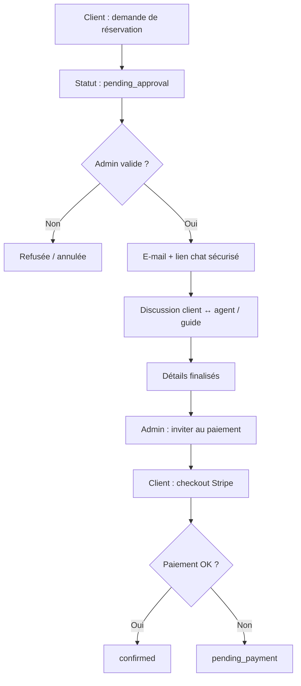

# Africa Tourism Gate — Roadmap évolutions client (guides & réservation assistée)

> **Mise à jour : juin 2026** — Document pour guider les PRs et les sessions Cursor Agent.  
> Branche de base : `main`. **Une PR = un livrable = une branche.**  
> Complète la roadmap principale : [roadmap-development.md](./roadmap-development.md)  
> Design web associé : [web-design-improvements.md](./web-design-improvements.md) (WEB-UX-15, WEB-UX-17)

---

## Synthèse fonctionnelle

Ce document couvre trois axes d’évolution orientés **expérience client** et **opérations agence** :

1. **Guides touristiques** — Associer des guides (agents internes ou prestataires externes) à une réservation, avec gestion et assignation côté admin.
2. **Réservation assistée** — Le client soumet une demande **sans paiement immédiat** ; l’admin valide, un e-mail renvoie le client vers un **chat** lié à la réservation ; le paiement Stripe n’intervient qu’après accord.
3. **Améliorations complémentaires** — Notifications, règles par vertical, évaluations guides, documents de voyage.

### Parcours cible



---

## Comment utiliser ce document

1. Lisez la **synthèse d’écarts** pour comprendre ce qui manque par rapport au code actuel.
2. Choisissez un livrable **CE-[N]** dans le tableau récapitulatif.
3. Vérifiez les **dépendances** (schéma DB, API, admin, web).
4. Copiez le **prompt détaillé** dans Cursor Agent.
5. Testez avec `pnpm dev` (API + admin + web).
6. Ne demandez un commit que lorsque vous êtes satisfait du résultat.

### Prompt méta (modèle réutilisable)

```
Projet : Africa Tourism Gate (pnpm monorepo).
Branche : crée et bascule sur `[BRANCHE]`.

Livrable CE-[N] : [TITRE]
Références :
- apps/api (NestJS, prefix /api, Swagger http://localhost:3000/api)
- apps/admin | apps/web (Next.js 14, App Router)
- packages/api-client, packages/types
- database/africatourismgate_database.sql, database/migrations/
- docs/roadmap-development-client-enhance.md
- docs/roadmap-development.md (livrables #27–33 booking, #57–58 support, #79 email)

Règles :
- Étendre BookingEngineService et le modèle bookings — ne pas réimplémenter Stripe ni l’auth.
- Nouveau statut booking : pending_approval (migration + booking_status_history).
- Messages utilisateur en français par défaut ; web i18n FR/EN/ES.
- RBAC sur endpoints admin sensibles (guides.write, bookings.approve, etc.).
- Pas de commit sauf si je le demande explicitement.

[PROMPT DÉTAILLÉ]

À la fin : résumer les fichiers modifiés, les migrations SQL, et comment tester (curl, Playwright, scénario admin → web).
```

### Légende des priorités

| Priorité  | Signification                                              |
| --------- | ---------------------------------------------------------- |
| **Haute** | Bloquant pour le parcours assisté ou la gestion des guides |
| **Moyenne** | Valeur métier forte, livrable indépendant              |
| **Basse** | Polish, confort, règles avancées                         |

---

## Écarts par rapport à l’existant (juin 2026)

| Besoin | État actuel | Fichiers / tables clés |
| ------ | ----------- | ---------------------- |
| Guides sur réservation | ❌ Aucun module guide | `employees` = RH, pas tourisme |
| Réserver sans payer | ⚠️ Flux direct `draft` → `pending_payment` → Stripe → `confirmed` | `bookings.status`, `BookingEngineService` |
| Validation admin avant paiement | ❌ Pas de `pending_approval` | `commerce.entity.ts`, migration `add_booking_status_history.sql` |
| Chat lié à la réservation | ⚠️ Tickets support génériques | `support_tickets` sans `booking_id` |
| E-mails transactionnels assistés | ⚠️ Confirmation post-paiement seulement | `apps/api/src/modules/email/` |
| Assignation guide côté admin | ❌ — | — |
| Règles par vertical (assisté vs immédiat) | ❌ — | Config org ou par `booking_items.item_type` |

**Statuts booking actuels :** `draft`, `pending_payment`, `confirmed`, `cancelled`, `refunded`.

---

## Tableau récapitulatif — livrables CE

| #     | Phase | Livrable | Priorité | Branche PR | Dépend de |
| ----- | ----- | -------- | -------- | ---------- | --------- |
| CE-1  | 1 | Schéma DB — `pending_approval`, guides, messages réservation | Haute | `feature/ce-booking-schema` | — |
| CE-2  | 2 | API — Module guides touristiques (CRUD admin) | Haute | `feature/ce-tour-guides-api` | CE-1 |
| CE-3  | 2 | API — Workflow réservation assistée (soumission sans paiement) | Haute | `feature/ce-assisted-booking-api` | CE-1 |
| CE-4  | 2 | API — Messagerie liée à la réservation | Haute | `feature/ce-booking-messages-api` | CE-1 |
| CE-5  | 2 | API — Actions admin (approuver, refuser, inviter au paiement) | Haute | `feature/ce-booking-approval-api` | CE-3 |
| CE-6  | 3 | API — E-mails transactionnels (demande, validation, lien chat/paiement) | Haute | `feature/ce-assisted-booking-emails` | CE-4, CE-5, #79 |
| CE-7  | 4 | Admin — Catalogue et assignation des guides | Haute | `feature/ce-admin-guides` | CE-2 |
| CE-8  | 4 | Admin — File d’attente validation + détail réservation assistée | Haute | `feature/ce-admin-booking-approval` | CE-5, CE-7 |
| CE-9  | 5 | Web — Parcours « Demander une réservation » (verticales configurées) | Haute | `feature/ce-web-assisted-request` | CE-3 |
| CE-10 | 5 | Web — Chat réservation + timeline statut client | Haute | `feature/ce-web-booking-conversation` | CE-4, CE-6 |
| CE-11 | 6 | Règles par vertical (assisté vs paiement immédiat) | Moyenne | `feature/ce-booking-mode-config` | CE-3 |
| CE-12 | 6 | Notifications (e-mail + badge compte client) | Moyenne | `feature/ce-booking-notifications` | CE-6, CE-10 |
| CE-13 | 7 | Évaluations guides post-séjour | Basse | `feature/ce-guide-reviews` | CE-2 |
| CE-14 | 7 | Documents de voyage / voucher PDF | Basse | `feature/ce-travel-documents` | CE-6 |

### Phases

| Phase | Objectif |
| ----- | -------- |
| **1** | Migrations SQL et types partagés |
| **2** | API métier (guides, workflow, messages, e-mails) |
| **3** | E-mails transactionnels |
| **4** | Interfaces admin |
| **5** | Parcours web client |
| **6** | Configuration et notifications |
| **7** | Finitions (avis guides, documents) |

### Ordre d’exécution recommandé

```
CE-1 → CE-2 → CE-3 → CE-4 → CE-5 → CE-6
              ↘ CE-7 (parallèle après CE-2)
              ↘ CE-8 (après CE-5 + CE-7)
CE-9 → CE-10 → CE-11 → CE-12 → CE-13 → CE-14
```

---

## Conventions de branches PR

- Préfixe : `feature/ce-*`
- Une PR = un livrable CE testable
- Titre PR exemple : `[CE-3] API: assisted booking request without immediate payment`
- Corps PR : résumé + migrations SQL + plan de test + captures si UI
- Ne pas mélanger polish WEB-UX et fonctionnel CE dans la même PR

---

## Prompts détaillés (copier-coller dans Cursor Agent)

### CE-1 — Schéma DB — statuts, guides, messages réservation

**Branche :** `feature/ce-booking-schema`

```
Projet : Africa Tourism Gate (pnpm monorepo).
Branche : crée et bascule sur `feature/ce-booking-schema`.

Livrable CE-1 : Schéma DB — pending_approval, guides, messages réservation
Références :
- database/africatourismgate_database.sql
- database/migrations/add_booking_status_history.sql
- apps/api/src/entities/generated/commerce.entity.ts
- packages/types/src/booking.ts

Objectif :
1. Ajouter le statut `pending_approval` à l’ENUM `bookings.status` et `booking_status_history`.
2. Créer la table `tour_guides` :
   - id, type ENUM('internal','external')
   - user_id nullable (lien employé interne)
   - organization_id nullable
   - display_name, bio, photo_url, languages (JSON), destinations (JSON ou table liaison)
   - status ENUM('active','inactive'), champs audit standard
3. Créer `booking_guide_assignments` :
   - booking_id, guide_id, role ENUM('primary','secondary'), assigned_at, assigned_by_user_id
4. Créer `booking_messages` :
   - booking_id, user_id nullable, body TEXT, is_staff TINYINT, created_at
   - (alternative : ajouter booking_id à support_tickets — préférer table dédiée pour clarté)
5. Optionnel : `organization_settings.booking_mode` ENUM('immediate','assisted') ou table config par item_type.

Critères :
- Migration SQL dans database/migrations/
- Régénérer ou mettre à jour les entités TypeORM générées
- Mettre à jour packages/types (BookingStatus, nouveaux types)
- Seed : 2 guides demo (1 interne, 1 externe)

À la fin : fichiers modifiés + commande migration + vérification pnpm db:sync.
```

### CE-2 — API — Module guides touristiques

**Branche :** `feature/ce-tour-guides-api`

```
Projet : Africa Tourism Gate (pnpm monorepo).
Branche : crée et bascule sur `feature/ce-tour-guides-api`.

Livrable CE-2 : API — Module guides touristiques (CRUD admin)
Références :
- CE-1 (tables tour_guides, booking_guide_assignments)
- Pattern : apps/api/src/modules/resources/employees/
- RBAC : ajouter permissions guides.read, guides.write

Endpoints admin :
- GET /tour-guides (liste paginée, filtres type/status/destination)
- GET /tour-guides/:id
- POST /tour-guides, PATCH /tour-guides/:id, DELETE soft
- POST /bookings/:id/guides — assigner un ou plusieurs guides
- DELETE /bookings/:id/guides/:guideId — retirer une assignation

DTO Swagger, PermissionsGuard, messages FR.

Critères : guide interne lié à user/employee ; guide externe sans compte obligatoire.

À la fin : fichiers + curl exemples + entrée api-client si pertinent.
```

### CE-3 — API — Workflow réservation assistée

**Branche :** `feature/ce-assisted-booking-api`

```
Projet : Africa Tourism Gate (pnpm monorepo).
Branche : crée et bascule sur `feature/ce-assisted-booking-api`.

Livrable CE-3 : API — Réservation assistée (soumission sans paiement)
Références :
- apps/api/src/modules/resources/bookings/booking-engine.service.ts
- Flux actuel : checkout → pending_payment → PaymentIntent

Objectif :
- Nouveau endpoint POST /bookings/request (ou flag sur POST /bookings)
- Crée booking en statut pending_approval (pas de PaymentIntent)
- Réutilise la logique checkout-preview pour calculer total et booking_items
- Réponse : booking id, statut, message « Demande enregistrée — en attente de validation »

Règles :
- Ne pas décrémenter définitivement le stock avant confirmation (ou soft-hold configurable)
- Historiser transition dans booking_status_history

Critères : test e2e ou supertest — création booking pending_approval sans appel Stripe.

À la fin : fichiers modifiés + scénario test.
```

### CE-4 — API — Messagerie liée à la réservation

**Branche :** `feature/ce-booking-messages-api`

```
Projet : Africa Tourism Gate (pnpm monorepo).
Branche : crée et bascule sur `feature/ce-booking-messages-api`.

Livrable CE-4 : API — Messagerie réservation
Références :
- apps/api/src/modules/resources/support-messages/ (pattern thread)
- Table booking_messages (CE-1)

Endpoints :
- GET /bookings/:id/messages — client (own) ou staff avec bookings.read
- POST /bookings/:id/messages — client ou staff
- Marquer is_staff pour les réponses admin/agent

Sécurité : le client ne voit que ses réservations ; token optionnel pour lien e-mail (CE-6).

À la fin : fichiers + test flux message client ↔ admin.
```

### CE-5 — API — Actions admin (approuver, refuser, inviter au paiement)

**Branche :** `feature/ce-booking-approval-api`

```
Projet : Africa Tourism Gate (pnpm monorepo).
Branche : crée et bascule sur `feature/ce-booking-approval-api`.

Livrable CE-5 : API — Approbation réservation assistée
Références :
- apps/api/src/modules/resources/bookings/bookings.service.ts
- apps/api/src/modules/stripe/stripe.service.ts (createPaymentIntent existant)

Endpoints admin (permission bookings.approve ou bookings.write) :
- POST /bookings/:id/approve — pending_approval → pending_payment (ou statut intermédiaire awaiting_payment)
  - Option : ajuster total_cents, assigner guide
- POST /bookings/:id/reject — → cancelled + motif optionnel
- POST /bookings/:id/invite-payment — génère/renvoie lien checkout sécurisé

Transitions validées ; refus si statut incompatible.

À la fin : fichiers + matrice des transitions de statuts documentée.
```

### CE-6 — API — E-mails transactionnels assistés

**Branche :** `feature/ce-assisted-booking-emails`

```
Projet : Africa Tourism Gate (pnpm monorepo).
Branche : crée et bascule sur `feature/ce-assisted-booking-emails`.

Livrable CE-6 : E-mails — parcours réservation assistée
Références :
- apps/api/src/modules/email/email.templates.ts
- Livrable #79 (SMTP) si pas encore en prod — fonctionner en dev (log ou Mailhog)

Templates :
1. booking_request_received — au client après CE-3
2. booking_approved_chat — lien vers /account/bookings/:id/chat (ou token signé)
3. booking_rejected — motif
4. booking_payment_invite — lien checkout Stripe

Déclenchement : hooks dans CE-3, CE-5 ; branding org si disponible.

À la fin : fichiers + aperçu HTML templates en dev.
```

### CE-7 — Admin — Catalogue et assignation des guides

**Branche :** `feature/ce-admin-guides`

```
Projet : Africa Tourism Gate (pnpm monorepo).
Branche : crée et bascule sur `feature/ce-admin-guides`.

Livrable CE-7 : Admin — Guides touristiques
Références :
- API CE-2
- Pattern : apps/admin/components/ (liste + formulaire CRUD)
- Registry : apps/admin/config/admin-sections.registry.ts

Pages :
- /guides — liste guides (nom, type, langues, statut)
- /guides/nouveau, /guides/[id] — édition profil
- Dans détail réservation : section « Guides assignés » + sélecteur

Critères : CRUD complet ; assignation depuis fiche réservation.

À la fin : fichiers + captures + test manuel admin.
```

### CE-8 — Admin — File d’attente validation

**Branche :** `feature/ce-admin-booking-approval`

```
Projet : Africa Tourism Gate (pnpm monorepo).
Branche : crée et bascule sur `feature/ce-admin-booking-approval`.

Livrable CE-8 : Admin — Validation réservations assistées
Références :
- API CE-4, CE-5, CE-7
- apps/admin/components/bookings/ (liste et détail existants)

UI :
- Filtre / onglet « En attente de validation » (pending_approval)
- Actions : Approuver, Refuser (modal motif), Inviter au paiement
- Panneau messages (thread CE-4) dans le détail réservation
- Affichage guides assignés

Critères : parcours complet admin sans quitter la fiche réservation.

À la fin : fichiers + scénario test admin → e-mail (mock) → statut mis à jour.
```

### CE-9 — Web — Parcours « Demander une réservation »

**Branche :** `feature/ce-web-assisted-request`

```
Projet : Africa Tourism Gate (pnpm monorepo).
Branche : crée et bascule sur `feature/ce-web-assisted-request`.

Livrable CE-9 : Web — Demande de réservation sans paiement immédiat
Références :
- apps/web/components/hotels/hotel-booking-sidebar.tsx (pattern sidebar)
- API CE-3
- i18n : apps/web/lib/i18n/translations.ts

Objectif :
- Pour verticales en mode « assisted » : CTA « Demander une réservation » au lieu de « Payer maintenant »
- Appel POST /bookings/request après recap panier
- Page succès : « Demande envoyée — vous serez contacté sous 24–48 h »
- Auth client requise (register/customer existant)

Config initiale : activités + forfaits en mode assisted ; hôtels/vols en immediate (CE-11 affinera).

À la fin : fichiers + test Playwright parcours demande.
```

### CE-10 — Web — Chat réservation + timeline client

**Branche :** `feature/ce-web-booking-conversation`

```
Projet : Africa Tourism Gate (pnpm monorepo).
Branche : crée et bascule sur `feature/ce-web-booking-conversation`.

Livrable CE-10 : Web — Conversation et suivi réservation assistée
Références :
- API CE-4, CE-6
- apps/web/components/account/ (réservations existantes)
- WEB-UX-15 espace compte

UI compte client (/account/bookings/[id]) :
- Timeline : demande → validation → discussion → paiement → confirmé
- Thread messages (style support ticket)
- Bouton « Procéder au paiement » visible si statut pending_payment et invitation envoyée

Lien e-mail CE-6 : deep link vers cette page (auth ou token).

À la fin : fichiers + test Playwright lecture/envoi message.
```

### CE-11 — Règles par vertical (assisté vs immédiat)

**Branche :** `feature/ce-booking-mode-config`

```
Projet : Africa Tourism Gate (pnpm monorepo).
Branche : crée et bascule sur `feature/ce-booking-mode-config`.

Livrable CE-11 : Configuration mode réservation par vertical
Références :
- organization_settings ou table dédiée (CE-1)
- CE-3, CE-9

Objectif :
- Admin : réglage par org — quels item_type sont « immediate » vs « assisted »
- API publique : exposer bookingMode dans checkout-preview ou config verticale
- Web : choix CTA dynamique selon config

Défaut suggéré : activity, package → assisted ; room, flight_class, vehicle, cabin → immediate.

À la fin : fichiers + doc des défauts.
```

### CE-12 — Notifications

**Branche :** `feature/ce-booking-notifications`

```
Projet : Africa Tourism Gate (pnpm monorepo).
Branche : crée et bascule sur `feature/ce-booking-notifications`.

Livrable CE-12 : Notifications réservation assistée
Références :
- CE-6, CE-10

Objectif :
- E-mail à chaque nouveau message staff (si client offline)
- Badge « action requise » sur liste réservations compte client
- Optionnel : rappel auto si pending_payment > 7 jours (cron ou job)

À la fin : fichiers + liste des événements notifiés.
```

### CE-13 — Évaluations guides (basse priorité)

**Branche :** `feature/ce-guide-reviews`

```
Projet : Africa Tourism Gate (pnpm monorepo).
Branche : crée et bascule sur `feature/ce-guide-reviews`.

Livrable CE-13 : Avis sur les guides
Références :
- Table reviews (entityType guide ou extension)
- CE-2

Après séjour confirmed : invitation à noter le guide assigné.
Modération admin (réutiliser #56).

À la fin : fichiers + flux post-séjour.
```

### CE-14 — Documents de voyage / voucher PDF (basse priorité)

**Branche :** `feature/ce-travel-documents`

```
Projet : Africa Tourism Gate (pnpm monorepo).
Branche : crée et bascule sur `feature/ce-travel-documents`.

Livrable CE-14 : Voucher et itinéraire PDF
Références :
- apps/api/src/modules/email/ (templates HTML existants)
- CE-6

Générer PDF ou HTML imprimable après confirmed : réf. booking, lignes, guides, contacts urgence.
Téléchargement depuis compte client + pièce jointe e-mail confirmation.

À la fin : fichiers + exemple PDF/HTML.
```

---

## Matrice des statuts booking (cible)

| Statut | Signification | Transitions possibles |
| ------ | ------------- | --------------------- |
| `draft` | Panier brouillon | → `pending_approval` ou `pending_payment` |
| `pending_approval` | Demande soumise, attente admin | → `pending_payment`, `cancelled` |
| `pending_payment` | Validée, attente paiement client | → `confirmed`, `cancelled` |
| `confirmed` | Payée et confirmée | → `cancelled`, `refunded` |
| `cancelled` | Annulée / refusée | — |
| `refunded` | Remboursée | — |

---

## Améliorations complémentaires (hors livrables CE)

| Idée | Bénéfice | Lien existant |
| ---- | -------- | ------------- |
| Calendrier disponibilité guides | Éviter double assignation | CE-2, CE-7 |
| Commission guides externes | Facturation partenaires | Comptabilité org |
| Inscription client web | Compte requis pour le chat | `POST /auth/register/customer` (branche en cours) |
| Espace compte enrichi | Confiance et suivi | WEB-UX-15 |
| Support générique | Tickets hors réservation | #57–58 roadmap principale |

---

## Documents liés

| Document | Rôle |
| -------- | ---- |
| [roadmap-development.md](./roadmap-development.md) | Roadmap principale (#53–83) |
| [web-design-improvements.md](./web-design-improvements.md) | Polish UI web (WEB-UX-15 compte, WEB-UX-17 support) |
| [admin-design-improvements.md](./admin-design-improvements.md) | Polish UI admin |
| [roadmap-prompts.md](./roadmap-prompts.md) | Historique livrables 1–52 |

---

## Notes pour l'agent Cursor

- **Ne pas casser** le flux paiement immédiat existant — le mode assisté est un chemin parallèle.
- **Toujours historiser** les changements de statut dans `booking_status_history`.
- **Guides internes** : préférer lien `user_id` / `employees` ; **externes** : fiche autonome sans compte obligatoire.
- **Sécurité** : liens e-mail chat/paiement via token JWT court ou signed URL avec `booking_id` + `user_id`.
- Croiser avec **#79** (SMTP) avant mise en production des e-mails CE-6.
- Tests : étendre `apps/web/tests/e2e/` (activity-checkout, reservation-checkout) avec variante assisted.

---

*Document pour guider les PRs évolutions client. Référencer CE-[N] dans titres et corps de PR.*
