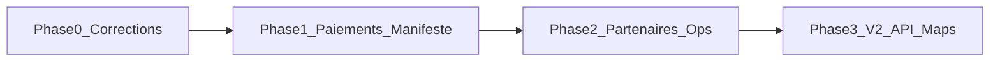

# Africa Tourism Gate — Roadmap post-réunion (corrections & nouvelles fonctionnalités)

> **Mise à jour : août 2026** — Suite à la réunion d’avancement du **29 août 2026**.  
> Branche de base : `main`. **Une PR = un livrable = une branche.**  
> Complète : [roadmap-development.md](./roadmap-development.md) · [roadmap-development-client-enhance.md](./roadmap-development-client-enhance.md)  
> Contexte réunion : [presentation-plateforme-08-29-2026.html](./presentation-plateforme-08-29-2026.html)

---

## Synthèse

La V1 couvre déjà **manifeste**, **réservation immédiate / assistée**, **guides**, **notifications staff**, **Stripe + cash**.  
Ce document couvre les **corrections** constatées en démo et les **intégrations** décidées en réunion (paiements, contact d’urgence, partenaires, carto, sync V2).

### Décisions retenues (réunion)

| Sujet | Décision |
| ----- | -------- |
| Sync API fournisseurs | **Hors V1** — back-office + réservation assistée ; sync en V2 |
| Paiements | Carte (Stripe) + **virement** + **acompte** ; cash on site seul = risqué pour le web |
| Mobile money | **V1 offline livré** (numéro + preuve) ; intégration PSP API = V2 (Est-Afrique) |
| Contact d’urgence | À intégrer au manifeste |
| Cartographie | OSM/Leaflet OK ; Google Maps = budget / phase ultérieure |
| Auth partenaires | Piste Gmail / OAuth pour onboarding |

---

## Comment utiliser ce document

1. Lisez la **synthèse d’écarts** (réunion × code actuel).
2. Choisissez un livrable **PR-xx** dans le tableau récapitulatif.
3. Vérifiez les **dépendances**.
4. Copiez le **prompt détaillé** dans Cursor Agent.
5. Testez avec `pnpm dev` (API + admin + web ± POS).
6. Ne demandez un commit que lorsque vous êtes satisfait du résultat.

### Prompt méta (modèle réutilisable)

```
Projet : Africa Tourism Gate (pnpm monorepo).
Branche : crée et bascule sur `[BRANCHE]`.

Livrable PR-[N] : [TITRE]
Références :
- apps/api (NestJS, prefix /api, Swagger http://localhost:3000/api)
- apps/admin | apps/web | apps/pos (Next.js 14, App Router)
- packages/ui, packages/api-client, packages/types
- database/migrations/
- docs/roadmap-post-reunion-08-2026.md
- docs/presentation-plateforme-08-29-2026.html

Règles :
- Réutiliser les patterns existants (BookingEngineService, CrudService, api-client, i18n web).
- Ne pas refactorer hors scope.
- RBAC (PermissionsGuard + @RequirePermissions) sur les nouveaux endpoints sensibles.
- Messages utilisateur en français par défaut ; web i18n FR/EN/ES.
- Pas de commit sauf si je le demande explicitement.

[PROMPT DÉTAILLÉ]

À la fin : résumer les fichiers modifiés, migrations SQL, et comment tester localement.
```

### Légende des priorités

| Priorité | Signification |
| -------- | ------------- |
| **Haute** | Correction démo / engagement commercial immédiat |
| **Moyenne** | Valeur métier forte, livrable indépendant |
| **Basse** | Différé (V2, budget, polish) |

---

## Écarts par rapport à l’existant (août 2026)

| Besoin (réunion) | État actuel | Fichiers / tables clés |
| ---------------- | ----------- | ---------------------- |
| Validation manifeste stricte (passeport, etc.) | ⚠️ Seul le nom complet est vraiment requis | `checkout-manifest-form.tsx`, `booking-manifest-entry.dto.ts`, `booking-manifest-entry.entity.ts` |
| Contact d’urgence | ✅ Name + phone requis checkout ; PDF + i18n (voir [pr-04-emergency-contact-test.md](./pr-04-emergency-contact-test.md)) | `emergency_contact_*`, manifeste Web/Admin/POS, `booking-detail-pdf*` |
| Conditions médicales structurées | ✅ 4 champs optionnels + legacy `conditions` (voir [pr-05-medical-conditions-test.md](./pr-05-medical-conditions-test.md)) | `allergies`, `serious_medical_conditions`, `current_medications`, `dietary_notes`, manifeste Web/Admin/POS, `booking-detail-pdf*` |
| PDF confirmation fiable (prod) | ✅ PJ confirmation + logo durci (voir [pr-02-pdf-confirmation-fix.md](./pr-02-pdf-confirmation-fix.md)) | `booking-detail-pdf*.ts`, `booking-engine.service.ts`, `email-attachments.ts` |
| Téléchargement PDF côté compte client | ✅ Endpoint + bouton compte (voir [pr-03-pdf-client-download.md](./pr-03-pdf-client-download.md)) | `GET /bookings/:id/confirmation-pdf`, `AccountBookingDetail` |
| Virement bancaire au checkout | ✅ `bank_transfer` + activation admin + comptes + **preuves** (voir [pr-06-bank-transfer-test.md](./pr-06-bank-transfer-test.md), [pr-06b-payment-proofs-test.md](./pr-06b-payment-proofs-test.md)) | `payment_methods`, `booking_payment_proofs`, checkout web, admin Documents |
| Acomptes / paiements partiels | ✅ Setting `booking/deposits` + multi-paiements ; `pending_payment` jusqu’au solde ; Stripe/cash/virement/preuves partiels (voir [pr-07-deposits-test.md](./pr-07-deposits-test.md)) | `organization_settings.deposits`, `paidCents` / `balanceCents`, `booking-engine`, `stripe.service` |
| Politique cash web | ✅ `payment_methods.cash` défaut **false** ; POS/admin inchangés (voir [pr-08-cash-policy-test.md](./pr-08-cash-policy-test.md)) | `DEFAULT_WEB_PAYMENT_METHODS`, migration `set_web_payment_methods_cash_default_false.sql`, checkout web |
| Partenaire vs Staff vs Client | ✅ Vocabulaire + RBAC catalogue (PR-09) ; compte auth partenaire = **PR-10** | `activity_providers`, `/produits/activites/partenaires`, `activities.read/write` |
| Liaison document ID ↔ voyageur | ❌ Upload non lié à l’entrée manifeste | `booking_identity_documents` |
| Portail / onboarding partenaire | ❌ Catalogue `activity_providers` ≠ compte auth ; OAuth Gmail staff/client OK ; pas de rôle `partner` ni portail B2B (PR-10) | `apps/api/src/modules/auth/`, `activity-providers` |
| Notifications staff persistées | ⚠️ Poll client + `localStorage` | `apps/admin/lib/notifications/use-admin-notifications.ts` |
| Google Maps | ❌ Leaflet + OSM | `apps/web/components/maps/*`, `coordinate-picker-map.tsx` |
| Sync API fournisseurs | ❌ Exclu V1 volontairement | — |
| Mobile money | ✅ Offline (pays/opérateur/numéro + preuves + email) — voir [pr-13-mobile-money-test.md](./pr-13-mobile-money-test.md) ; PSP API reporté | `mobile_money_*`, `payment_methods.mobile_money`, checkout web, admin Paramètres |
| Réservation immédiate / assistée | ✅ Mature | `booking-engine.service.ts`, `booking-approval.service.ts` |
| Assignation guides | ✅ Mature | `booking-guide-assignments.service.ts` |

---

## Tableau récapitulatif — livrables PR

| # | Phase | Livrable | Priorité | Branche PR | Dépend de |
| - | ----- | -------- | -------- | ---------- | --------- |
| PR-01 | 0 | Validation manifeste checkout (champs obligatoires) | Haute | `feature/pr-01-manifest-validation` | — |
| PR-02 | 0 | Stabiliser PDF confirmation (email + branding) | Haute | `feature/pr-02-pdf-confirmation-fix` | — |
| PR-03 | 0 | Download PDF confirmation — compte client | Haute | `feature/pr-03-pdf-client-download` | PR-02 |
| PR-04 | 1 | Contact d’urgence sur manifeste | Haute | `feature/pr-04-emergency-contact` | — |
| PR-05 | 1 | Conditions médicales structurées | Moyenne | `feature/pr-05-medical-conditions` | PR-04 (optionnel) |
| PR-06 | 1 | Paiement par virement bancaire | Haute | `feature/pr-06-bank-transfer` | — |
| PR-07 | 1 | Acomptes / paiements partiels — **livré** (voir [pr-07-deposits-test.md](./pr-07-deposits-test.md)) | Haute | `feature/pr-07-booking-deposits` | PR-06 |
| PR-08 | 1 | Politique cash (restreindre web) — **livré** (voir [pr-08-cash-policy-test.md](./pr-08-cash-policy-test.md)) | Haute | `feature/pr-08-cash-policy` | — |
| PR-09 | 2 | Clarifier Partenaire vs Staff vs Client (UI + RBAC) — **livré** | Moyenne | `feature/pr-09-partner-roles` | — |
| PR-10 | 2 | Onboarding partenaires (questionnaire + invitation Gmail) | Moyenne | `feature/pr-10-partner-onboarding` | PR-09 |
| PR-11 | 2 | Liaison document identité ↔ entrée manifeste | Moyenne | `feature/pr-11-manifest-doc-link` | — |
| PR-12 | 2 | Notifications admin persistées (serveur) | Basse | `feature/pr-12-notifications-persist` | — |
| PR-13 | 3 | Mobile money offline (Est-Afrique) — **config + checkout + preuves livrés** ; PSP API V2 | Basse | `feature/pr-13-mobile-money` | PR-06 / preuves |
| PR-14 | 3 | Google Maps (clé API + import / enrichissement) | Basse | `feature/pr-14-google-maps` | — |
| PR-15 | 3 | Sync inventaire fournisseurs (Excel/FTP puis API) | Basse | `feature/pr-15-supplier-sync` | PR-10 |

### Phases

| Phase | Objectif | Horizon indicatif |
| ----- | -------- | ----------------- |
| **0** | Corrections urgentes (démo / prod) | 1–2 semaines |
| **1** | Manifeste enrichi + paiements V1.1 | 2–4 semaines |
| **2** | Partenaires & opérations | 3–6 semaines |
| **3** | V2 différé (MM, Maps, sync) | Post-V1.1 |

### Ordre d’exécution recommandé

```
Phase 0 : PR-01 ∥ PR-02 → PR-03
Phase 1 : PR-04 ∥ PR-08 ∥ PR-06 → PR-07 → PR-05
Phase 2 : PR-09 → PR-10 ; PR-11 ∥ PR-12
Phase 3 : PR-13 , PR-14 , PR-15 (indépendants une fois Phase 1–2 stables)
```



---

## Conventions de branches PR

- Préfixe : `feature/pr-*`
- Une PR = un livrable testable
- Titre PR exemple : `[PR-06] Payments: bank transfer checkout method`
- Corps PR : résumé + migrations SQL + plan de test + captures si UI
- Ne pas mélanger un livrable Phase 0 correction et un livrable Phase 3 V2 dans la même PR

---

## Prompts détaillés (copier-coller dans Cursor Agent)

### PR-01 — Validation manifeste checkout

**Branche :** `feature/pr-01-manifest-validation`  
**Priorité :** Haute

```
Projet : Africa Tourism Gate (pnpm monorepo).
Branche : crée et bascule sur `feature/pr-01-manifest-validation`.

Livrable PR-01 : Validation manifeste checkout (champs obligatoires)
Références :
- apps/web/components/reservations/checkout-manifest-form.tsx
- apps/api/src/modules/resources/bookings/dto/booking-manifest-entry.dto.ts
- apps/api/src/modules/resources/bookings/booking-manifest.service.ts
- apps/api/src/entities/booking-manifest-entry.entity.ts
- apps/pos (sale-manifest-sheet.tsx si présent)
- packages/types + i18n apps/web/lib/i18n/

Objectif (feedback Andy en démo) :
1. Rendre obligatoires côté API + UI : fullName, nationality, idNumber (passeport/ID), et tout champ métier jugé critique pour le voyage.
2. Laisser sex/gender OPTIONNEL.
3. Afficher des astérisques (*) et messages d’erreur clairs (FR/EN/ES).
4. Aligner admin + POS sur la même règle (ou documenter l’exception POS si staff peut compléter plus tard).

Critères d’acceptation :
- Impossible de valider le checkout web avec idNumber vide.
- sex peut rester null.
- Messages i18n mis à jour (supprimer « Only the full name is required » si encore présent).
- Tests manuels ou Playwright sur le parcours manifeste.

Scénario de test : docs/pr-01-manifest-validation-test.md

À la fin : fichiers modifiés + scénario de test.
```

---

### PR-02 — Stabiliser PDF confirmation

**Branche :** `feature/pr-02-pdf-confirmation-fix`  
**Priorité :** Haute

```
Projet : Africa Tourism Gate (pnpm monorepo).
Branche : crée et bascule sur `feature/pr-02-pdf-confirmation-fix`.

Livrable PR-02 : Stabiliser PDF confirmation (email + branding)
Références :
- apps/api/src/modules/email/booking-detail-pdf.service.ts
- apps/api/src/modules/email/booking-detail-pdf.renderer.ts
- apps/api/src/modules/email/booking-detail-pdf-enrichment.service.ts
- apps/api/src/modules/email/email.service.ts
- apps/api/test/unit/booking-detail-pdf.spec.ts

Objectif (bug démo : PDF non attaché / format cassé en prod) :
1. Diagnostiquer pourquoi la PJ PDF échoue hors local (chemins assets logo, timeouts, buffers, SMTP).
2. Garantir logo org + contenu manifeste + montant sur le PDF.
3. Renforcer les tests unitaires du renderer (cas sans logo, multi-voyageurs).
4. Logger clairement les échecs d’attachement sans bloquer l’email texte/HTML.

Critères d’acceptation :
- Après confirmation, l’email client contient une PJ PDF ouvrable.
- Logo présent quand configuré ; fallback propre sinon.
- Spec unitaires passent.

Cause racine + retest : docs/pr-02-pdf-confirmation-fix.md

À la fin : cause racine documentée en 3–5 lignes + fichiers + comment retester l’email.
```

---

### PR-03 — Download PDF confirmation — compte client

**Branche :** `feature/pr-03-pdf-client-download`  
**Priorité :** Haute  
**Dépend de :** PR-02

```
Projet : Africa Tourism Gate (pnpm monorepo).
Branche : crée et bascule sur `feature/pr-03-pdf-client-download`.

Livrable PR-03 : Endpoint + UI téléchargement PDF confirmation (compte client)
Références :
- PR-02 (booking-detail-pdf.*)
- apps/web (account booking detail / recap)
- apps/api bookings.controller.ts
- packages/api-client

Objectif :
1. Ajouter un endpoint authentifié du type GET /bookings/:id/confirmation-pdf (owner ou staff).
2. Exposer la méthode dans api-client.
3. Bouton « Télécharger la confirmation » sur le détail réservation compte web (statuts confirmed / pertinents).

Critères d’acceptation :
- Un client connecté télécharge le PDF de SA réservation uniquement (403 sinon).
- Même contenu que la PJ email (réutiliser le service PDF).
- i18n du libellé bouton.

Curl + chemin UI + test manuel : docs/pr-03-pdf-client-download.md

À la fin : curl + chemin UI + test manuel.
```

---

### PR-04 — Contact d’urgence sur manifeste

**Branche :** `feature/pr-04-emergency-contact`  
**Priorité :** Haute

```
Projet : Africa Tourism Gate (pnpm monorepo).
Branche : crée et bascule sur `feature/pr-04-emergency-contact`.

Livrable PR-04 : Contact d’urgence sur manifeste voyageur
Références :
- apps/api/src/entities/booking-manifest-entry.entity.ts
- database/migrations/
- booking-manifest.service.ts + DTOs
- apps/web/components/reservations/checkout-manifest-form.tsx
- apps/admin/components/bookings/booking-manifest-section.tsx
- POS sale-manifest si applicable
- packages/types

Objectif (demande Andy) :
1. Migration : champs emergency_contact_name, emergency_contact_phone, emergency_contact_email,
   emergency_contact_country, emergency_contact_address (rue/ville) — nullable ou required selon règle métier (recommandé : name + phone required au checkout).
2. API create/update/list incluent les champs.
3. Formulaires Web / Admin / POS.
4. Inclure le contact d’urgence dans le PDF confirmation (booking-detail-pdf).

Critères d’acceptation :
- Checkout refuse une entrée sans nom + téléphone d’urgence.
- Visible en admin et dans le PDF.
- i18n FR/EN/ES.

Scénario de test : docs/pr-04-emergency-contact-test.md

À la fin : migration SQL + fichiers + scénario test.
```

---

### PR-05 — Conditions médicales structurées

**Branche :** `feature/pr-05-medical-conditions`  
**Priorité :** Moyenne  
**Dépend de :** PR-04 (recommandé, même zone manifeste)

```
Projet : Africa Tourism Gate (pnpm monorepo).
Branche : crée et bascule sur `feature/pr-05-medical-conditions`.

Livrable PR-05 : Conditions médicales structurées (légères)
Références :
- booking_manifest_entries.conditions (texte libre actuel)
- Formulaires manifeste web/admin/POS
- PDF labels

Objectif :
1. Remplacer ou compléter `conditions` par des champs structurés légers :
   - allergies (text)
   - serious_medical_conditions (text)
   - current_medications (text)
   - optional: dietary_notes (text)
2. Garder compatibilité : migrer l’ancien texte libre vers un des champs ou `other`.
3. Afficher dans admin + PDF (section « Informations médicales »).
4. Ne PAS inventer un dossier médical complexe (pas de fichiers médicaux hors scope).

Critères d’acceptation :
- Formulaire clair, champs optionnels sauf si produit décide autrement.
- Anciennes résas avec `conditions` restent lisibles.
- i18n.

Scénario de test : docs/pr-05-medical-conditions-test.md

À la fin : migration + mapping rétrocompat + test.
```

---

### PR-06 — Paiement par virement bancaire

**Branche :** `feature/pr-06-bank-transfer`  
**Priorité :** Haute

```
Projet : Africa Tourism Gate (pnpm monorepo).
Branche : crée et bascule sur `feature/pr-06-bank-transfer`.

Livrable PR-06 : Méthode preferredPaymentMethod = bank_transfer
Références :
- packages/types/src/booking.ts (BookingPreferredPaymentMethod)
- apps/api commerce.entity / bookings DTOs
- apps/api/src/modules/resources/organization-bank-accounts/
- Checkout web récap + flux assisté (invite-payment)
- Admin enregistrement paiement manuel

Objectif (compromis réunion Andy/Carin) :
1. Étendre l’enum : 'stripe' | 'cash' | 'bank_transfer'.
2. Au checkout / post-approbation : si bank_transfer, afficher les comptes org actifs (IBAN/banque/titulaire) en lecture seule.
3. Statut booking : rester pending_payment jusqu’à validation staff du virement (preuve / marquage payé).
4. Admin : action « Marquer virement reçu » (réutiliser patterns cash-payment / payments existants).
5. Emails : instructions de virement + référence booking.

Critères d’acceptation :
- Client peut choisir virement et voit les coordonnées bancaires.
- Réservation non confirmed tant que staff n’a pas enregistré le paiement.
- Migration enum MySQL + types + Swagger + api-client.

Scénario de test : docs/pr-06-bank-transfer-test.md  
Preuves de paiement (upload client + review admin) : docs/pr-06b-payment-proofs-test.md

À la fin : scénario web + admin + fichiers.
```

---

### PR-07 — Acomptes / paiements partiels

**Branche :** `feature/pr-07-booking-deposits`  
**Priorité :** Haute  
**Dépend de :** PR-06  
**Statut :** ✅ Livré — scénario de test : [pr-07-deposits-test.md](./pr-07-deposits-test.md)

**Modèle retenu :** pas de `confirmed_deposit` ; rester `pending_payment` tant que `sum(succeeded) < total` ; passer à `confirmed` uniquement quand soldé. Exposer `paidCents` / `balanceCents` / `depositRequiredCents`. Politique d’annulation = texte i18n informatif uniquement.

```
Projet : Africa Tourism Gate (pnpm monorepo).
Branche : crée et bascule sur `feature/pr-07-booking-deposits`.

Livrable PR-07 : Acomptes (ex. 30–50 %) + solde
Références :
- Module payments / Stripe
- booking-engine + booking-approval
- Organization settings (nouveau % acompte configurable)
- docs/pr-07-deposits-test.md

Objectif :
1. Paramètre org : deposit_percent (ex. 30 ou 50) ou montant fixe optionnel.
2. Permettre un premier paiement (Stripe ou enregistrement virement/cash partiel) = acompte.
3. Solde restant exigible avant confirmation finale OU avant date de service (règle documentée).
4. UI client : montant acompte vs total ; UI admin : historique paiements partiels.
5. Documenter la règle d’annulation (non-remboursement total si délai non respecté) en texte produit / i18n — pas un moteur juridique.

Critères d’acceptation :
- Une réservation peut avoir plusieurs payments liés ; somme < total ⇒ pas confirmed (pending_payment) ; confirmed uniquement si soldé.
- Stripe Checkout peut encaisser l’acompte puis le solde.
- Staff peut enregistrer un paiement partiel bank_transfer/cash/mobile_money.
- Doc de test : docs/pr-07-deposits-test.md

À la fin : modèle de statuts choisi + migration + tests.
```

---

### PR-08 — Politique cash (restreindre web)

**Branche :** `feature/pr-08-cash-policy`  
**Priorité :** Haute  
**Statut :** ✅ Livré — scénario de test : [pr-08-cash-policy-test.md](./pr-08-cash-policy-test.md)

**Modèle retenu :** pas de nouveau setting `allow_web_cash` — le booléen existant `booking` / `payment_methods.cash` **est** l’autorisation cash web (défaut `false`). POS et `recordCashPayment` admin hors gate. Migration `set_web_payment_methods_cash_default_false.sql` aligne les rows existantes.

```
Projet : Africa Tourism Gate (pnpm monorepo).
Branche : crée et bascule sur `feature/pr-08-cash-policy`.

Livrable PR-08 : Restreindre cash on site pour les réservations web
Références :
- Checkout web preferredPaymentMethod
- Setting org booking/payment_methods.cash (= allow_web_cash)
- POS sale-payment (cash reste autorisé)
- Flux assisté admin
- docs/pr-08-cash-policy-test.md

Objectif (position Andy : cash seul = dangereux) :
1. Sur le site web public : ne plus proposer cash par défaut ; réactivation explicite via Paramètres (`payment_methods.cash`).
2. Conserver cash sur POS et enregistrement staff (back-office).
3. Message clair si un ancien booking cash existe.
4. Setting org : payment_methods.cash (default false) — alias produit « allow_web_cash ».

Critères d’acceptation :
- Parcours web immédiat : pas de cash (sauf setting explicitement activé).
- POS : cash toujours possible.
- i18n des messages.
- Doc de test : docs/pr-08-cash-policy-test.md

À la fin : diff UI + setting si ajouté.
```

---

### PR-09 — Clarifier Partenaire vs Staff vs Client

**Branche :** `feature/pr-09-partner-roles`  
**Priorité :** Moyenne  
**Statut :** ✅ Livré

#### Modèle retenu (Client / Staff / Partenaire)

| Concept | Aujourd’hui | Notes |
| ------- | ----------- | ----- |
| **Client** | Rôle auth `customer` | Compte voyageur (web) ; inscription → `customer` |
| **Staff** | Rôles internes (`org_admin`, `support`, `super_admin`, …) + permissions RBAC | Employés / utilisateurs admin ; pas un seul code `staff` |
| **Partenaire** | Fiche catalogue `activity_providers` (UI : Partenaires d’activités) | **≠** compte auth ; pas de rôle `partner` en seed |
| Compte auth partenaire | **PR-10** | Invitation / onboarding Gmail ; hors PR-09 |

- API technique : routes `/activity-providers`, permissions réutilisées `activities.read` / `activities.write`.
- URL admin : `/produits/activites/partenaires` (redirect depuis l’ancienne URL `fournisseurs`).
- Paiement : libellé **Prestataire** (`paymentProvider`) — ne pas confondre avec Partenaire catalogue.

```
Projet : Africa Tourism Gate (pnpm monorepo).
Branche : crée et bascule sur `feature/pr-09-partner-roles`.

Livrable PR-09 : Distinction rôles Partenaire / Staff / Client (UI + RBAC)
Références :
- Présentation 08-29 (renommage Fournisseur → Partenaire)
- activity-providers (catalogue)
- Admin users / employees / roles / departments
- Labels UI admin FR / EN / ES

Objectif :
1. Audit terminologique : remplacer libellés « fournisseur » ambigus par « partenaire » là où il s’agit d’un prestataire métier.
2. Clarifier que activity-providers ≠ compte auth.
3. Documenter dans docs/ (courte section) le modèle : Client / Staff interne / Partenaire (futur compte).
4. Ajuster permissions si des trous RBAC existent sur les écrans partenaires.

Critères d’acceptation :
- UI admin cohérente (pas de mélange Fournisseur/Partenaire sur le même concept).
- Aucune régression auth.
- Note courte dans ce roadmap ou presentation users.
- API activity-providers protégée (activities.read/write) ; UI write gated.

À la fin : liste des chaînes renommées + captures si utile.
```

---

### PR-10 — Onboarding partenaires

**Branche :** `feature/pr-10-partner-onboarding`  
**Priorité :** Moyenne  
**Dépend de :** PR-09

```
Projet : Africa Tourism Gate (pnpm monorepo).
Branche : crée et bascule sur `feature/pr-10-partner-onboarding`.

Livrable PR-10 : Onboarding partenaires (questionnaire + invitation Gmail)
Références :
- Auth Google / Gmail (apps/api/src/modules/auth/, gmail.utils.ts)
- organization settings / activity-providers
- Présentation : questionnaire attributs hébergements partenaires

Objectif (V1.5 — pas encore sync API) :
1. Formulaire / questionnaire standardisé attributs hébergement partenaire (champs métier minimaux).
2. Flux d’invitation email (lien) + option inscription via Gmail pour un rôle partenaire limité.
3. Espace minimal partenaire OU admin-only intake (si portail complet trop large : intake admin + statut « partenaire invité »).
4. Ne PAS implémenter sync inventaire (réservé PR-15).

Critères d’acceptation :
- Un staff peut inviter un partenaire ; le partenaire complète le questionnaire.
- Données stockées et consultables en admin.
- Auth Gmail réutilisée, pas de nouveau IdP.

À la fin : périmètre exact (intake vs portail) documenté + fichiers.
```

---

### PR-11 — Liaison document identité ↔ entrée manifeste

**Branche :** `feature/pr-11-manifest-doc-link`  
**Priorité :** Moyenne

```
Projet : Africa Tourism Gate (pnpm monorepo).
Branche : crée et bascule sur `feature/pr-11-manifest-doc-link`.

Livrable PR-11 : FK document identité → manifest entry
Références :
- booking_identity_documents
- booking_manifest_entries
- upload checkout (reservation-recap / CameraCapture)
- admin booking-identity-documents-panel

Objectif :
1. Ajouter manifest_entry_id (nullable puis required pour nouveaux uploads) sur booking_identity_documents.
2. Au checkout, lier le fichier/caméra à l’entrée voyageur correspondante.
3. Admin : afficher le doc sous le bon voyageur ; review/refuse inchangés.

Critères d’acceptation :
- Un booking multi-passagers a des docs rattachés au bon voyageur.
- Migration + backfill best-effort si possible (sinon null pour l’historique).

À la fin : migration + UI + test multi-passagers.
```

---

### PR-12 — Notifications admin persistées

**Branche :** `feature/pr-12-notifications-persist`  
**Priorité :** Basse

```
Projet : Africa Tourism Gate (pnpm monorepo).
Branche : crée et bascule sur `feature/pr-12-notifications-persist`.

Livrable PR-12 : Centre de notifications staff côté serveur
Références :
- apps/admin/lib/notifications/use-admin-notifications.ts (localStorage aujourd’hui)
- booking-assisted-email / événements booking

Objectif :
1. Table notifications (user_id, type, payload JSON, read_at, created_at).
2. Écrire une notif à la création pending_approval, message client, etc.
3. API list + mark read ; hook admin consomme l’API au lieu de localStorage seul.
4. Pas de WebSocket/FCM dans ce livrable (polling OK).

Critères d’acceptation :
- Lu/non-lu partagé entre navigateurs pour le même user.
- Badge admin cohérent après refresh.

À la fin : migration + endpoints + branchement hook.
```

---

### PR-13 — Mobile money (Est-Afrique)

**Branche :** `feature/pr-13-mobile-money`  
**Priorité :** Basse  
**Dépend de :** PR-06 / preuves (pattern offline)  
**État V1 :** ✅ **Livré en mode offline** (config org + checkout + preuves + emails + guards). Intégration PSP (Flutterwave / MoMo API) **reportée** en V2.

Scénario de test : [pr-13-mobile-money-test.md](./pr-13-mobile-money-test.md)

```
Projet : Africa Tourism Gate (pnpm monorepo).
Branche : `feature/pr-13-mobile-money`.

Livrable PR-13 (V1 — offline, livré) :
- preferredPaymentMethod 'mobile_money' + setting payment_methods.mobile_money
- Tables mobile_money_countries / operators / payment_numbers + CRUD admin + logos
- Checkout web : pays → opérateur → numéro + preuve (même pipeline que bank_transfer)
- Emails d’instructions + guards Stripe / invite / rappel
- Admin : Marquer Mobile Money reçu ou valider preuve

Hors scope V1 / V2 :
1. Choisir un provider PSP (Flutterwave, Africa's Talking, MoMo API) — fixer avant code.
2. Checkout / webhook / confirmation comme Stripe.
3. Sandbox + runbook env vars + idempotence webhook.

Critères d’acceptation V1 :
- Setting off → MM absent du checkout ; setting on + config → instructions + preuve → confirmed.
- Voir docs/pr-13-mobile-money-test.md.

À la fin (V1) : doc test + fichiers listés dans pr-13-mobile-money-test.md.
```

---

### PR-14 — Google Maps

**Branche :** `feature/pr-14-google-maps`  
**Priorité :** Basse

```
Projet : Africa Tourism Gate (pnpm monorepo).
Branche : crée et bascule sur `feature/pr-14-google-maps`.

Livrable PR-14 : Intégration Google Maps (budgeté)
Références :
- apps/web/components/maps/* (Leaflet/OSM actuel)
- apps/admin/components/maps/coordinate-picker-map.tsx
- docs/production-domains.md / env

Objectif :
1. Introduire la clé API Google Maps (Maps JavaScript / Places selon besoin réel).
2. Remplacer OU dual-mode (feature flag) les cartes critiques (itinéraire package, picker admin).
3. Documenter le coût et le fallback OSM si clé absente.
4. Ne pas casser les pages si NEXT_PUBLIC_GOOGLE_MAPS_KEY manquant.

Critères d’acceptation :
- Avec clé : carte Google fonctionnelle sur au moins 1 parcours web + picker admin.
- Sans clé : fallback OSM sans erreur console bloquante.
- README / env example mis à jour.

À la fin : flag + fichiers + note budget.
```

---

### PR-15 — Sync inventaire fournisseurs (V2)

**Branche :** `feature/pr-15-supplier-sync`  
**Priorité :** Basse  
**Dépend de :** PR-10

```
Projet : Africa Tourism Gate (pnpm monorepo).
Branche : crée et bascule sur `feature/pr-15-supplier-sync`.

Livrable PR-15 : Sync inventaire partenaires (Excel/FTP d’abord, API ensuite)
Références :
- Décision réunion : pas d’API forcée en V1
- activity-providers / hébergements / schedules
- PR-10 onboarding

Objectif (approche progressive Andy) :
1. Phase A : import manuel / semi-auto fichier Excel (disponibilités chambres) → mise à jour inventaire local.
2. Phase B (optionnelle dans la même PR ou PR-15b) : dépôt FTP planifié.
3. Phase C : connecteur API partenaire — UNIQUEMENT si doc API fournie ; sinon stub + backlog.
4. Réservation assistée reste le filet de sécurité en cas de conflit stock.

Critères d’acceptation :
- Staff peut importer un Excel modèle et voir les dispos mises à jour.
- Journal d’import (succès / erreurs lignes).
- Aucune dépendance runtime à une API tierce obligatoire.

À la fin : template Excel + endpoint import + doc ops.
```

---

## Critères globaux de done (tous livrables)

- [ ] Branche `feature/pr-*` dédiée
- [ ] Types partagés (`packages/types`) + `api-client` à jour si endpoints nouveaux
- [ ] Migration SQL dans `database/migrations/` si schéma touché
- [ ] i18n web FR/EN/ES pour textes utilisateur
- [ ] RBAC sur endpoints admin sensibles
- [ ] Scénario de test manuel documenté dans la PR
- [ ] Pas de sync API fournisseurs avant PR-15
- [ ] Pas de commit sauf demande explicite

---

## Hors scope explicite (rappel)

| Sujet | Motif |
| ----- | ----- |
| Imposer des APIs à tous les hôtels/agences en V1 | Décision stratégique terrain (réunion) |
| Push mobile / FCM guides | Différé ; email suffit en V1.1 |
| App mobile guide dédiée | Hors roadmap actuelle |
| Refonte complète design web/admin | Voir `web-design-improvements.md` / `admin-design-improvements.md` |

---

## Lien avec les autres roadmaps

| Document | Rôle |
| -------- | ---- |
| [roadmap-development.md](./roadmap-development.md) | Socle produit & livrables historiques |
| [roadmap-development-client-enhance.md](./roadmap-development-client-enhance.md) | Guides + réservation assistée (largement livré) |
| [roadmap-pos.md](./roadmap-pos.md) | POS — cash reste légitime ici ([PR-08](./pr-08-cash-policy-test.md)) |
| [pr-08-cash-policy-test.md](./pr-08-cash-policy-test.md) | Scénario de test — cash web off par défaut |
| [presentation-plateforme-users.md](./presentation-plateforme-users.md) | Vue utilisateurs — catalogue partenaires ≠ compte auth (PR-09) |
| [presentation-plateforme-08-29-2026.html](./presentation-plateforme-08-29-2026.html) | Support de la réunion source |
