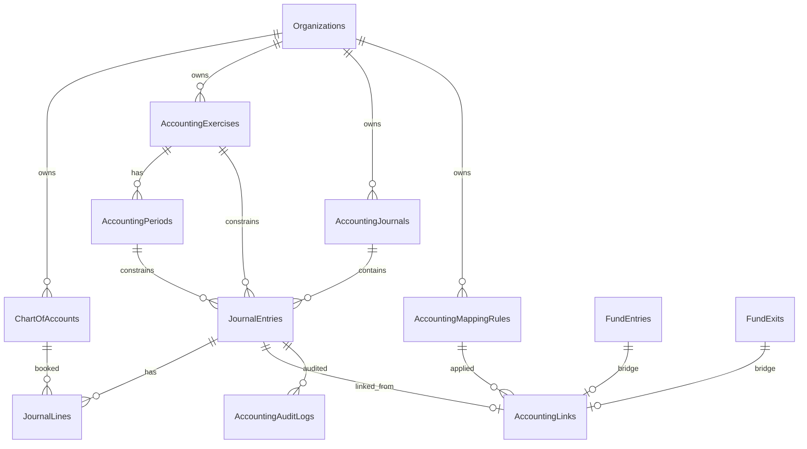

# Module Comptabilité SYSCOHADA — Modèle de domaine (SYSCO-001)

> **Statut :** spécification cible avant migrations (SYSCO-002…003) et moteur d’écritures (SYSCO-004…005).  
> **Périmètre épic :** comptabilité réglementaire OHADA branchée sur le module Trésorerie.  
> **Amont livré :** stub `accounting_links` (TRESO-039) · UI placeholder (TRESO-040) · handoff (TRESO-041).

**Documents liés :**  
[tresorerie-syscohada-epic-next.md](./tresorerie-syscohada-epic-next.md) ·  
[admin-syscohada-github-tasks.md](./admin-syscohada-github-tasks.md) ·  
[tresorerie-domain-model.md](./tresorerie-domain-model.md) §4.7 / §10 ·  
[admin-tresorerie-github-tasks.md](./admin-tresorerie-github-tasks.md)

---

## 1. Objectif métier

Compléter la chaîne Trésorerie :

**… → Justificatifs → enregistrement opérationnel → pont `accounting_links` → écritures SYSCOHADA → livres → clôtures / états**

| Branche | Rôle dans cet épic |
| ------- | ------------------ |
| **Financière (TRESO)** | Source d’opérations (`fund_entries` / `fund_exits`) — **inchangée** |
| **Comptable (SYSCO)** | Plan, journaux, exercices, écritures, mapping, livres, clôtures MVP |

Référentiel cible : **SYSCOHADA** (Système Comptable OHADA) — classes 1–8, partie double, journaux, états financiers.

---

## 2. Principes transverses

| Principe | Décision |
| -------- | -------- |
| Montants | Entiers en **cents** (`*_cents`), alignés Trésorerie / Bookings |
| Devise opération | ISO 4217 sur chaque `fund_*` (inchangé) |
| Devise de tenue | **Une devise d’exercice** par org (`accounting_exercises.currency`) — typiquement `XOF` ou `XAF` |
| Conversion | Si `fund_*.currency ≠` devise de tenue : taux à la date d’opération → montants d’écriture en devise de tenue ; conserver devise/montant d’origine en métadonnées ligne ou sur le link |
| Identifiants | UUID `char(36)` |
| Multi-tenant | `organization_id` sur **tous** les agrégats comptables |
| Soft delete | Comptes / règles / journaux : soft-delete possible ; **écritures postées** : pas de delete — contrepassation uniquement |
| Partie double | Toute écriture : Σ débits = Σ crédits (même devise de tenue) |
| Idempotence pont | Une opération fond = au plus un `accounting_links` actif (voir §8.3) |
| Non-objectifs | Ne pas remplacer `payments` ; ne pas fusionner `fund_entries` ↔ `payments` |

---

## 3. Décisions tranchées (recommandations SYSCO-001)

> À valider en revue finance / tech lead. Tant que non coché en §14, traiter comme **recommandation de spec** (implémentation suit ces choix sauf contre-ordre).

| Sujet | Options | **Recommandation** | Raison |
| ----- | ------- | ------------------ | ------ |
| Moment de comptabilisation | (A) auto à `recorded` (B) aussi à `disbursed` (C) batch (D) manuel seul | **(A)+(D)** : éligible dès `recorded` ; déclencheur MVP = action **« Comptabiliser »** (API) ; auto-post à `recorded` en option post-MVP | Sortie `disbursed` sans justificatif trop tôt ; manuel maîtrise le go-live |
| Multi-devise | Multi-tenue vs une devise d’exercice | **Une devise de tenue / exercice** ; conversion à la date d’op | États OHADA mono-devise ; ops multi-devises restent possibles |
| Soft-delete + unique | Unique global vs actif seul | Unique `(fund_op_type, fund_op_id)` **parmi `deleted_at IS NULL`** (index partiel ou recreate après soft-delete) | Permet recreate après `skipped` / erreur `pending` |
| Contrepassation | Update in-place vs nouvelle pièce | **Nouvelle `journal_entry` de contrepassation** ; link historique conservé ; void fond reste bloqué si `linked` | Intégrité légale des pièces |
| Tiers / immos / stocks | Inclus MVP vs satellite | **Épic satellite** — hors SYSCO-001…012 sauf comptes collectifs minimaux au plan | Focus trésorerie → écritures |
| Coexistence `payments` | Fusion vs écriture séparée | **Écriture SYSCO uniquement via `fund_*`** ; `payments` commerce hors générateur | Handoff §2.7 |

### 3.1. Éligibilité à la comptabilisation

| Opération | Statut minimum | Notes |
| --------- | -------------- | ----- |
| `fund_entry` | `recorded` | Pas de void |
| `fund_exit` | `recorded` | Justificatif déjà exigé par TRESO avant `recorded` |

`disbursed` seul : **non éligible** au MVP (peut être revisité si finance exige compta à la sortie de caisse).

---

## 4. Diagramme entités (cible)



---

## 5. Entités et schémas

### 5.1. `chart_of_accounts` — Plan comptable

Comptes SYSCOHADA par organisation (classes 1–8). Sous-comptes = lignes avec `code` plus long + `parent_id` optionnel.

| Champ | Type | Notes |
| ----- | ---- | ----- |
| `id` | UUID PK | |
| `organization_id` | UUID FK | |
| `code` | varchar(20) | Ex. `521`, `5211`, `701` — unique par org (actifs) |
| `label` | varchar(255) | Libellé |
| `class_number` | tinyint | 1–8 (SYSCOHADA) |
| `account_type` | enum | Voir §6.1 |
| `parent_id` | UUID null | Hiérarchie sous-comptes |
| `is_postable` | bool | `false` = compte de regroupement (pas de ligne directe) |
| `is_active` | bool | |
| `syscohada_ref` | varchar(20) null | Code référentiel officiel si distinct du `code` local |
| audit / soft-delete | | BaseAudit |

**Unicité :** `(organization_id, code)` parmi non soft-deleted.

**Seed MVP (SYSCO-002 — org plateforme, codes alignés hints stub) :**

| Code | Classe | Type | Usage |
| ---- | ------ | ---- | ----- |
| `57` | 5 | treasury | Caisse (hint stub `57`) |
| `521` | 5 | treasury | Banques locales |
| `538` | 5 | treasury | Mobile money et assimilés |
| `411` | 4 | third_party | Clients (collectif) |
| `60` | 6 | expense | Achats (sortie défaut / hint `60`) |
| `61` | 6 | expense | Services extérieurs (hint `61`) |
| `70` | 7 | revenue | Ventes (entrée défaut / hint `70`) |

> Revue finance peut ajuster libellés / sous-comptes ; les codes ci-dessus sont le référentiel seed jusqu’à validation.

---

### 5.2. `accounting_exercises` — Exercices

| Champ | Type | Notes |
| ----- | ---- | ----- |
| `id` | UUID PK | |
| `organization_id` | UUID FK | |
| `code` | varchar(20) | Ex. `2026` |
| `label` | varchar(120) | |
| `starts_on` | date | |
| `ends_on` | date | |
| `currency` | char(3) | **Devise de tenue** |
| `status` | enum | `open` \| `closing` \| `closed` |
| `closed_at` / `closed_by_user_id` | nullable | |

**Unicité :** `(organization_id, code)`.  
**Règle :** au plus un exercice `open` « courant » recommandé (plusieurs `open` possibles si chevauchement interdit par dates).

---

### 5.3. `accounting_periods` — Périodes

| Champ | Type | Notes |
| ----- | ---- | ----- |
| `id` | UUID PK | |
| `exercise_id` | UUID FK | |
| `organization_id` | UUID FK | Dénormalisé pour filtres |
| `code` | varchar(20) | Ex. `2026-01` |
| `starts_on` / `ends_on` | date | |
| `status` | enum | `open` \| `locked` \| `closed` |
| `sequence_no` | smallint | Ordre dans l’exercice |

**Règle :** aucune écriture nouvelle si période `locked`/`closed` ou exercice `closed`.

---

### 5.4. `accounting_journals` — Journaux paramétrables

| Champ | Type | Notes |
| ----- | ---- | ----- |
| `id` | UUID PK | |
| `organization_id` | UUID FK | |
| `code` | varchar(20) | Ex. `CAI`, `BQ`, `OD`, `AC`, `VE` |
| `label` | varchar(120) | |
| `journal_type` | enum | Voir §6.2 |
| `default_account_id` | UUID null | Compte trésorerie par défaut (caisse/banque) |
| `next_entry_seq` | int | Compteur numérotation (ou table séquence dédiée) |
| `is_active` | bool | |

**Seed MVP :** `CAI` (caisse), `BQ` (banque), `OD` (opérations diverses), éventuellement `AC`/`VE` si saisie manuelle hors mapping trésorerie.

---

### 5.5. `journal_entries` — Écritures (pièces)

| Champ | Type | Notes |
| ----- | ---- | ----- |
| `id` | UUID PK | |
| `organization_id` | UUID FK | |
| `journal_id` | UUID FK | |
| `exercise_id` | UUID FK | |
| `period_id` | UUID FK | |
| `entry_number` | varchar(40) | Numéro légal affiché (ex. `CAI-2026-00042`) |
| `entry_seq` | int | Séquence numérique dans journal+exercice |
| `entry_date` | date | Date comptable |
| `description` | varchar(500) | Libellé pièce |
| `status` | enum | `draft` \| `posted` \| `reversed` |
| `source` | enum | `treasury_mapping` \| `manual` \| `closing` \| `reversal` |
| `reverses_entry_id` | UUID null | Si contrepassation |
| `posted_at` / `posted_by_user_id` | nullable | |
| `currency` | char(3) | = devise de tenue de l’exercice |
| audit | | pas de soft-delete une fois `posted` |

**Règles :**

1. Passage `draft` → `posted` : lignes ≥ 2, équilibre, période ouverte.
2. `reversed` : uniquement via création d’une pièce `source = reversal` liée.
3. Numérotation : `(journal_id, exercise_id, entry_seq)` unique ; `entry_number` dérivé.

---

### 5.6. `journal_lines` — Lignes d’écriture

| Champ | Type | Notes |
| ----- | ---- | ----- |
| `id` | UUID PK | |
| `journal_entry_id` | UUID FK | |
| `organization_id` | UUID FK | |
| `line_no` | smallint | Ordre |
| `account_id` | UUID FK | Compte `is_postable = true` |
| `label` | varchar(255) null | Libellé ligne |
| `debit_cents` | int | ≥ 0 |
| `credit_cents` | int | ≥ 0 |
| `original_amount_cents` | int null | Montant op. source si conversion |
| `original_currency` | char(3) null | |
| `fx_rate` | decimal null | Taux utilisé si conversion |
| `analytic_ref_type` | varchar null | Optionnel MVP+ : `booking`, `activity`, … |
| `analytic_ref_id` | UUID null | |

**Contrainte ligne :** exactement un de `debit_cents` / `credit_cents` > 0 (pas les deux).  
**Contrainte pièce :** Σ `debit_cents` = Σ `credit_cents`.

---

### 5.7. `accounting_mapping_rules` — Règles de mapping

Remplace le skeleton `TREASURY_ACCOUNTING_MAPPING_CONFIG` (`stub: true`).

| Champ | Type | Notes |
| ----- | ---- | ----- |
| `id` | UUID PK | |
| `organization_id` | UUID FK | |
| `key` | varchar(120) | Ex. `fund_entry.booking_payment` — stable |
| `version` | int | Versioning ; résolution = dernière version active |
| `fund_op_type` | enum | `fund_entry` \| `fund_exit` |
| `match_source` | varchar null | `FundEntrySource` si entrée ; null = wildcard |
| `match_payment_method` | varchar null | `TreasuryPaymentMethod` ; null = wildcard |
| `journal_id` | UUID FK | Journal cible (CAI / BQ / OD) |
| `debit_account_id` | UUID FK | Compte réel du plan |
| `credit_account_id` | UUID FK | |
| `priority` | int | Plus haut = plus spécifique |
| `is_active` | bool | |
| `label` / `notes` | | |

**Résolution (SYSCO-004) :**

1. Filtrer `fund_op_type` + org + actifs.
2. Scorer spécificité (`match_source` / `match_payment_method` non null).
3. Prendre `priority` max puis `version` max.
4. Écrire `mapping_rule_key` (= `key`) sur le link.

**Migration depuis stub :**

| Clé stub | Évolution |
| -------- | --------- |
| `fund_entry.default` | Comptes validés + journal selon `payment_method` (CAI si `cash`, BQ sinon) |
| `fund_entry.booking_payment` | Débit trésorerie / crédit `411` (ou produits selon choix finance) |
| `fund_exit.default` / `fund_exit.expense_request` | Débit charges / crédit trésorerie |

`GET /accounting-links/mapping-config` : `stub: false` + `schemaVersion` une fois le référentiel DB actif.

---

### 5.8. `accounting_links` — Pont (évolution stub TRESO-039)

Table **existante** — pas de refonte ; comportement enrichi.

| Champ | Usage SYSCO |
| ----- | ----------- |
| `fund_op_type` + `fund_op_id` | Source ; unique parmi non-deleted |
| `journal_entry_id` | UUID de la pièce `posted` (nullable tant que `pending`) |
| `mapping_rule_key` | `accounting_mapping_rules.key` résolue |
| `status` | `pending` → génération ; `linked` → écriture posée ; `skipped` → exclu |

**Flux de statuts :**

```text
(absent) --Comptabiliser--> pending --écriture posted--> linked
(absent|pending) --Ignorer--> skipped
pending --échec génération--> pending (rejouable)
linked --rejeu--> no-op (200) ou 409 métier
linked --void fond--> BLOQUÉ (gate existante)
```

**Contrepassation comptable :** nouvelle `journal_entry` (`reversal`) ; le link `linked` **reste** (traçabilité op → pièce d’origine). Option future : `reversal_journal_entry_id` sur le link (hors MVP schéma minimal).

**Soft-delete :** autorisé si `pending` ou `skipped` pour permettre recreate ; **interdit** si `linked` sans processus de contrepassation documenté (service).

---

### 5.9. `accounting_audit_logs` — Audit écritures

Module dédié (ne remplace pas `treasury_audit_logs`).

| Champ | Notes |
| ----- | ----- |
| `id`, `organization_id` | |
| `entity_type` | `journal_entry` \| `journal_line` \| `chart_account` \| `exercise` \| `period` \| `mapping_rule` \| `accounting_link` \| … |
| `entity_id` | UUID |
| `action` | `create` \| `update` \| `post` \| `reverse` \| `lock` \| `close` \| `skip` \| … |
| `actor_type` / `actor_id` | `user` \| `system` |
| `old_json` / `new_json` | |
| `correlation_treasury_audit_id` | UUID null — lien optionnel |
| `created_at` | |

---

### 5.10. Rapprochements (SYSCO-007 — schéma indicatif)

| Table | Rôle |
| ----- | ---- |
| `bank_statements` | Relevés (compte banque, période, solde) |
| `bank_statement_lines` | Lignes relevé |
| `bank_reconciliations` | Session de rapprochement |
| `bank_reconciliation_items` | Pointer `journal_line` et/ou `fund_op` ↔ ligne relevé |

Détail colonnes en SYSCO-007 ; réservé ici pour cardinaux.

---

## 6. Enums

### 6.1. `ChartAccountType`

| Valeur | Classes typiques |
| ------ | ---------------- |
| `equity` | 1 |
| `fixed_asset` | 2 |
| `inventory` | 3 |
| `third_party` | 4 |
| `treasury` | 5 |
| `expense` | 6 |
| `revenue` | 7 |
| `special` | 8 |

### 6.2. `AccountingJournalType`

`cash` | `bank` | `purchases` | `sales` | `general` (OD) | `other`

### 6.3. `AccountingExerciseStatus` / `AccountingPeriodStatus`

- Exercice : `open` | `closing` | `closed`
- Période : `open` | `locked` | `closed`

### 6.4. `JournalEntryStatus` / `JournalEntrySource`

- Status : `draft` | `posted` | `reversed`
- Source : `treasury_mapping` | `manual` | `closing` | `reversal`

### 6.5. Pont (existant)

- `AccountingLinkStatus` : `pending` | `linked` | `skipped`
- `AccountingFundOpType` : `fund_entry` | `fund_exit`

---

## 7. Flux opération → mapping → link → écriture

Aligné handoff §4.

```mermaid
sequenceDiagram
  participant Op as Fund entry/exit (recorded)
  participant API as POST …/post ou Comptabiliser
  participant Map as Mapping engine
  participant Link as accounting_links
  participant JE as journal_entries + lines

  Op->>API: action Comptabiliser
  API->>API: assert éligible (recorded, not voided)
  API->>Map: resolve rule (source, payment_method, type)
  Map->>Link: upsert pending + mapping_rule_key
  Map->>JE: create draft then post (journal selon règle)
  JE-->>Link: journal_entry_id
  Link->>Link: status = linked
  Note over Op: void fond bloqué si linked
```

### 7.1. Étapes service (SYSCO-004 / 005)

1. Vérifier éligibilité (§3.1) + org + exercice/période ouverts pour `entry_date` (= `operation_date` fond, sauf override).
2. Résoudre règle mapping → comptes + journal.
3. Upsert `accounting_links` `pending` (idempotent sur clé fond).
4. Créer `journal_entries` + `journal_lines` équilibrées (`source = treasury_mapping`).
5. Poster l’écriture ; renseigner `journal_entry_id` ; `status = linked`.
6. Audit accounting + optionnel corrélation treasury.

### 7.2. Cas `skipped`

- Action « Ignorer » (permission `accounting.post` ou dédiée).
- Pas d’écriture ; link `skipped` pour traçabilité.
- Recreate possible après soft-delete du link (politique §3).

### 7.3. Idempotence

| État link | Rejeu « Comptabiliser » |
| --------- | ----------------------- |
| absent | Crée pending → linked |
| `pending` | Reprend génération |
| `linked` | No-op succès ou 409 (à figer en API : **recommandé no-op 200**) |
| `skipped` | 409 sauf force explicite (hors MVP) |

---

## 8. Numérotation légale

| Objet | Règle MVP |
| ----- | --------- |
| Pièce | `{journal.code}-{exercise.code}-{entry_seq:05d}` → `entry_number` |
| Séquence | Monotone par `(journal_id, exercise_id)` ; pas de trou volontaire (échec post-alloc = trou acceptable documenté) |
| Justificatifs | Réutilisent attachments TRESO ; pas de n° légal séparé MVP |
| Journaux | Code stable org (`CAI`, `BQ`, …) |

---

## 9. Permissions RBAC (`accounting.*`)

Complète `treasury.*` (inchangé). Pattern TRESO-008 / SYSCO-009.

| Permission | Usage |
| ---------- | ----- |
| `accounting.read` | Navigation hub compta, listes lectures |
| `accounting.chart.read` | Plan comptable |
| `accounting.chart.write` | CRUD comptes (finance admin) |
| `accounting.journal.read` | Journal / grand livre / balance |
| `accounting.journal.write` | Saisie manuelle OD / draft |
| `accounting.post` | Comptabiliser / poster / ignorer (skip) |
| `accounting.reconcile` | Rapprochements (SYSCO-007) |
| `accounting.close` | Verrou période / clôture exercice |
| `accounting.audit.read` | Journal d’audit écritures |
| `accounting.reports.read` | Bilan / CR / exports états |

**Transition stub :**

| Avant (TRESO) | Après (SYSCO) |
| ------------- | ------------- |
| `treasury.accounting_link.read` | Conservée pour lecture links **ou** migrée vers `accounting.read` (décision SYSCO-009 : **recommandé garder + ajouter `accounting.*`**, bridge page exige l’une ou l’autre) |

**Profils indicatifs :**

| Profil | Permissions |
| ------ | ----------- |
| Lecteur compta | `accounting.read`, `journal.read`, `reports.read` |
| Comptable | + `journal.write`, `post`, `reconcile` |
| Responsable finance | + `chart.write`, `close`, `audit.read` |
| Contrôle | `read`, `journal.read`, `audit.read`, `reports.read` |

`super_admin` : bypass inchangé.

---

## 10. Routes Admin cibles

Préfixe : sous `/tresorerie/comptabilite` (évolution TRESO-040) et/ou `/comptabilite/*`.

| Route | Contenu | Tâche |
| ----- | ------- | ----- |
| `/tresorerie/comptabilite` | Hub links + actions Comptabiliser / Ignorer | SYSCO-010 |
| `…/journal` | Livre-journal | SYSCO-006 |
| `…/grand-livre` | Grand livre | SYSCO-006 |
| `…/balance` | Balance | SYSCO-006 |
| `…/caisse` / `…/banque` | Livres + rapprochements | SYSCO-007 |
| `…/cloture` | Clôtures | SYSCO-008 |
| `…/bilan` / `…/compte-resultat` | États | SYSCO-008 |
| `…/plan` | Plan comptable | SYSCO-002 UI légère |
| `…/audit` | Audit écritures | SYSCO-009 |

Pas de faux écrans avant données réelles (règle TRESO-040 conservée).

---

## 11. Vues dérivées (pas de tables obligatoires MVP)

| Vue métier | Source |
| ---------- | ------ |
| Journal | `journal_entries` + lines filtrées journal/période |
| Grand livre | lines groupées par `account_id` + running balance |
| Balance | agrégats débit/crédit/solde par compte / période |
| Livre de caisse | journal `CAI` ∪ lines compte caisse ∪ ops `payment_method = cash` comptabilisées |
| Livre de banque | journal `BQ` ∪ comptes banque |
| Bilan / CR | classes 1–5 vs 6–7 (+ OD clôture) — SYSCO-008 |

---

## 12. Hors scope (explicite)

### 12.1. Hors épic SYSCO-001…012 (satellite ou plus tard)

- Auxiliaires clients / fournisseurs complets + lettrage avancé
- Immobilisations & amortissements
- Stocks / inventaires
- Établissements / axes analytiques complets (refs optionnelles sur lines OK plus tard)
- Exports fiscal / liasse / déclaration
- Remplacement du module `payments`
- Fusion `fund_entries` ↔ `payments`
- Refonte RBAC hors `accounting.*` / pont
- Multi-devise de tenue concurrente dans un même exercice

### 12.2. Toujours hors cible produit (handoff §2.7)

- Compta comme substitut des encaissements commerce
- Une seule table pour paiements web et trésorerie opérationnelle

---

## 13. Alignement code existant

| Existant | Usage SYSCO |
| -------- | ----------- |
| `accounting_links` + API | Pont ; `journal_entry_id` rempli en SYSCO-005 |
| `TREASURY_ACCOUNTING_MAPPING_CONFIG` | Remplacé par `accounting_mapping_rules` (SYSCO-004) |
| `assertFundOpNotAccountingLinked` | Conservé ; `linked` bloque void |
| `fund_entries` / `fund_exits` | Uniques sources auto-post MVP |
| `treasury_audit_logs` | Corrélation ; audit pièces dans `accounting_audit_logs` |
| `/tresorerie/comptabilite` | Hub réel (SYSCO-010) |
| Montants cents + ISO | Identiques sur lines (devise de tenue) |

---

## 14. Critères SYSCO-001 — checklist

- [x] Schéma tables + enums documentés (§5–6)
- [x] Moments de comptabilisation tranchés — **recommandation** §3 (revue humaine à confirmer)
- [x] Consommation stub `accounting_link` alignée handoff §4 (§5.8, §7)
- [x] Hors-scope explicite (§12)
- [x] Permissions `accounting.*` listées (§9)
- [x] Multi-org, devise de tenue, numérotation (§2, §5.2, §8)
- [ ] Revue validée finance / tech lead — **à cocher après relecture humaine**

---

## 15. Suite immédiate

| Tâche | Livrable |
| ----- | -------- |
| SYSCO-002 — ✅ | Migrations `chart_of_accounts` + `accounting_exercises` / `accounting_periods` + seed + API lecture |
| SYSCO-003 — ✅ | Migrations `accounting_journals` + `journal_entries` + `journal_lines` + API create/list |
| SYSCO-004 | Moteur mapping + API « Comptabiliser » |
| SYSCO-005 | Remplir `journal_entry_id` + statuts link |
| SYSCO-009 | Seed RBAC `accounting.*` (peut démarrer en parallèle dès API) |

---

*Spec SYSCO-001 — septembre 2026. Mettre à jour ce fichier si la revue finance modifie §3.*
