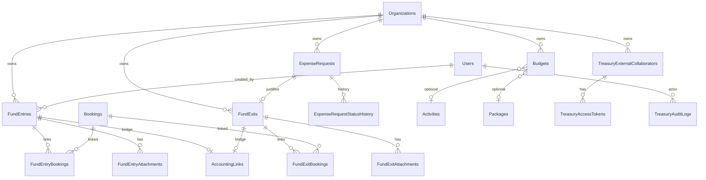
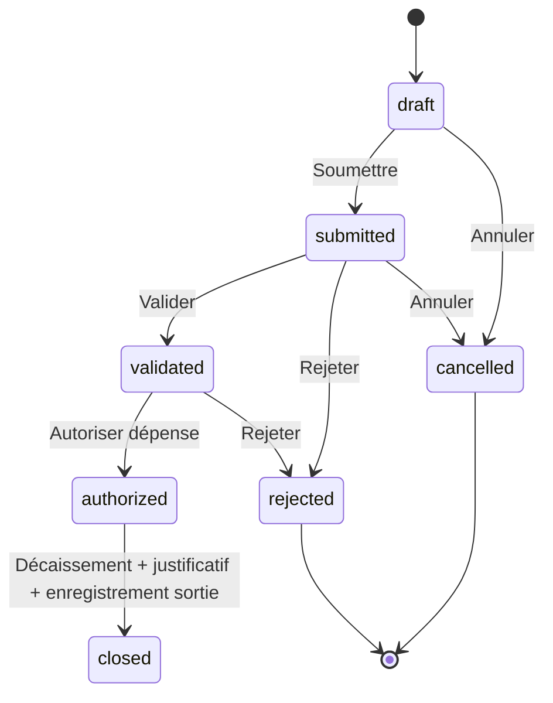

# Module Trésorerie — Modèle de domaine (TRESO-001)

> **Statut :** spécification cible avant migrations (TRESO-002…006) et API.  
> **Périmètre lot :** UI Admin + contrats API minimaux.  
> **Hors scope :** comptabilité SYSCOHADA complète → voir **TRESO-041** dans [admin-tresorerie-github-tasks.md](./admin-tresorerie-github-tasks.md) et futur `docs/tresorerie-syscohada-epic-next.md`.

**Documents liés :** [admin-tresorerie-github-tasks.md](./admin-tresorerie-github-tasks.md) · `Bookings` dans [`commerce.entity.ts`](../apps/api/src/entities/generated/commerce.entity.ts)

---

## 1. Objectif métier

Chaîne intégrée :

**Budget → Demande (état de besoin) → Validation → Autorisation → Trésorerie (décaissement / entrée) → Justificatifs → (pont comptable stub) → Audit**

Deux branches :

| Branche | Rôle dans ce lot |
| ------- | ---------------- |
| **Financière** | Flux de fonds, budgets, workflow sorties, traçabilité |
| **Comptable** | **Stub uniquement** (`accounting_links`) — pas de plan SYSCOHADA, journal, bilan, etc. |

---

## 2. Principes transverses

| Principe | Décision |
| -------- | -------- |
| Montants | Entiers en **cents** (`amount_cents`), comme `Bookings.totalCents` / `Payments` |
| Devise | ISO 4217, `varchar(3)` (ex. `XOF`, `EUR`, `USD`) |
| Identifiants | UUID `char(36)` |
| Multi-tenant | `organization_id` sur les agrégats trésorerie (aligné departments / catalog) |
| Soft delete / annulation | Pas de delete hard des opérations validées → statut `voided` + audit |
| Pièces jointes | Métadonnées (storage key, mime, size, uploaded_by) — pattern proche payment proofs |
| Réservations | Relation **(0,N)** via tables pivot ; une opération peut n’avoir **aucune** réservation |

---

## 3. Diagramme entités (cible)

---

## 4. Entités et cardinaux

### 4.1. `fund_entries` — Entrées de fonds

Enregistrement d’une rentrée d’argent, traçable, avec source explicite.

| Champ | Type | Notes |
| ----- | ---- | ----- |
| `id` | UUID PK | |
| `organization_id` | UUID FK | |
| `amount_cents` | int | > 0 |
| `currency` | char(3) | |
| `operation_date` | date | Date métier de l’entrée |
| `source` | enum | Voir §5.1 |
| `payment_method` | enum | Voir §5.2 |
| `reference` | varchar(120) null | Réf. bancaire / reçu / externe |
| `notes` | text null | Observations |
| `status` | enum | `recorded` \| `voided` |
| `created_by_user_id` | UUID FK | Utilisateur interne ayant saisi |
| `voided_at` / `voided_by` / `void_reason` | nullable | Si annulée |
| audit colonnes | | `created_at`, `updated_at` (BaseAudit) |

**Relation réservations :** `fund_entry_bookings`  
`fund_entries` **(0,N)** `bookings` — pivot `(fund_entry_id, booking_id)` unique.

**Justificatifs :** `fund_entry_attachments` (0,N).

---

### 4.2. `expense_requests` — États de besoin / demandes de dépense

Toute sortie de fonds **doit** être justifiée par un état de besoin.

| Champ | Type | Notes |
| ----- | ---- | ----- |
| `id` | UUID PK | |
| `organization_id` | UUID FK | |
| `title` | varchar(255) | |
| `description` | text | Justification métier |
| `requested_amount_cents` | int | Montant demandé |
| `currency` | char(3) | |
| `status` | enum | Voir §5.3 / circuit §6 |
| `requested_by_user_id` | UUID null | User interne |
| `requested_by_external_id` | UUID null | Collaborateur externe (xor avec user) |
| `needed_by_date` | date null | |
| `rejection_reason` | text null | |
| timestamps workflow | nullable | `submitted_at`, `validated_at`, `authorized_at`, … |

**Historique :** `expense_request_status_history` (append-only) — `from_status`, `to_status`, `actor_type` (`user`\|`external`), `actor_id`, `comment`, `created_at`.

---

### 4.3. `fund_exits` — Sorties de fonds

| Champ | Type | Notes |
| ----- | ---- | ----- |
| `id` | UUID PK | |
| `organization_id` | UUID FK | |
| `expense_request_id` | UUID FK **NOT NULL** | Obligation métier + contrainte |
| `amount_cents` | int | ≤ montant autorisé du besoin (règle service) |
| `currency` | char(3) | Alignée sur le besoin |
| `operation_date` | date | Date de décaissement |
| `payment_method` | enum | §5.2 |
| `reference` | varchar(120) null | |
| `notes` | text null | |
| `status` | enum | `draft` \| `disbursed` \| `recorded` \| `voided` |
| `created_by_user_id` | UUID FK | |
| void fields | nullable | Comme entrées |

**Relation réservations :** `fund_exit_bookings` — **(0,N)** identique aux entrées.

**Justificatifs :** `fund_exit_attachments` (obligatoires avant passage à `recorded` — règle service TRESO-022).

---

### 4.4. `budgets`

| Champ | Type | Notes |
| ----- | ---- | ----- |
| `id` | UUID PK | |
| `organization_id` | UUID FK | |
| `label` | varchar(255) | |
| `period_type` | enum | `monthly` \| `annual` |
| `year` | smallint | |
| `month` | tinyint null | 1–12 si monthly |
| `amount_cents` | int | Montant budgété |
| `currency` | char(3) | |
| `scope_type` | enum | `general` \| `activity` \| `product` |
| `activity_id` | UUID null | Si `scope_type = activity` |
| `product_type` | enum null | Aligné booking items : `activity_schedule`, `package`, `room`, … ou sous-ensemble métier |
| `product_id` | UUID null | Réf. polymorphe selon `product_type` |
| `notes` | text null | |

Unicité suggérée : `(organization_id, period_type, year, month, scope_type, activity_id, product_type, product_id, currency)`.

**Réalisé (lecture) :** agrégation des `fund_entries` / `fund_exits` sur la période (TRESO-026 / 035) — pas de table « réalisé » séparée dans ce lot.

---

### 4.5. Collaborateurs externes

#### `treasury_external_collaborators`

| Champ | Notes |
| ----- | ----- |
| `id`, `organization_id`, `email` | Email unique par org |
| `display_name` | nullable |
| `is_active` | bool — activation par responsable financier |
| `scopes` | JSON / table liée — ex. `["expense_requests.create"]` |
| `created_by_user_id`, timestamps | |

#### `treasury_access_tokens`

| Champ | Notes |
| ----- | ----- |
| `id`, `collaborator_id` | |
| `token_hash` | Jamais le jeton en clair |
| `expires_at` | |
| `revoked_at` | nullable |
| `last_used_at` | nullable |

Flux : invitation e-mail → lien signé / jeton → création d’état de besoin (TRESO-027…030).

---

### 4.6. `treasury_audit_logs`

Journal append-only des opérations sensibles.

| Champ | Notes |
| ----- | ----- |
| `id`, `organization_id` | |
| `entity_type` | `fund_entry` \| `fund_exit` \| `expense_request` \| `budget` \| `external_collaborator` \| `accounting_link` \| … |
| `entity_id` | UUID |
| `action` | `create` \| `update` \| `transition` \| `void` \| `attach` \| `invite` \| `activate` \| `deactivate` \| … |
| `actor_type` | `user` \| `external` \| `system` |
| `actor_id` | UUID nullable |
| `old_json` | JSON null |
| `new_json` | JSON null |
| `created_at` | |

---

### 4.7. `accounting_links` — Pont comptable **stub**

Traçabilité opération financière ↔ écriture comptable **future** (SYSCOHADA hors lot).

| Champ | Notes |
| ----- | ----- |
| `id` | |
| `organization_id` | |
| `fund_op_type` | `fund_entry` \| `fund_exit` |
| `fund_op_id` | UUID |
| `journal_entry_id` | UUID **nullable** — rempli par l’épic SYSCOHADA |
| `mapping_rule_key` | varchar null — clé config skeleton |
| `status` | `pending` \| `linked` \| `skipped` |
| timestamps | |

**Interdit dans ce lot :** génération d’écritures, plan comptable, journaux, bilans.

**API stub (TRESO-039) :**
- `GET/POST /accounting-links` · `GET/PATCH /accounting-links/:id`
- `GET /accounting-links/mapping-config` — skeleton JSON (`TREASURY_ACCOUNTING_MAPPING_CONFIG`)
- Permission : `treasury.accounting_link.read` (lecture **et** création stub)
- `journal_entry_id` optionnel ; statut `pending` | `linked` | `skipped`
- Gate void : `assertFundOpNotAccountingLinked` bloque si `status=linked`

---

## 5. Enums

### 5.1. Source d’entrée (`FundEntrySource`)

Origine des fonds (justification / suivi) :

| Valeur | Libellé indicatif |
| ------ | ----------------- |
| `booking_payment` | Paiement lié réservation(s) |
| `customer_direct` | Client hors réservation tracée |
| `partner` | Partenaire / B2B |
| `grant_donation` | Subvention / don |
| `owner_capital` | Apport |
| `bank_interest` | Intérêts |
| `other` | Autre (notes obligatoires) |

### 5.2. Mode de paiement (`TreasuryPaymentMethod`)

Aligné autant que possible sur `BookingPreferredPaymentMethod` / paiements existants :

| Valeur | Notes |
| ------ | ----- |
| `cash` | Espèces |
| `bank_transfer` | Virement |
| `mobile_money` | Mobile money |
| `stripe` | Carte / Stripe (si rapprochement entrée) |
| `cheque` | Chèque (trésorerie, pas forcément checkout web) |
| `other` | Autre |

### 5.3. Statuts état de besoin (`ExpenseRequestStatus`)

| Statut | Signification |
| ------ | ------------- |
| `draft` | Brouillon |
| `submitted` | Soumis |
| `validated` | Validé (contrôle métier) |
| `authorized` | Autorisation de dépense |
| `rejected` | Rejeté (terminal sauf éventuel resubmit → `draft`/`submitted`) |
| `cancelled` | Annulé par demandeur / admin |
| `closed` | Clôturé après décaissement + enregistrement |

### 5.4. Statuts sortie (`FundExitStatus`)

| Statut | Signification |
| ------ | ------------- |
| `draft` | Préparé, pas encore décaissé |
| `disbursed` | Décaissement effectué |
| `recorded` | Justificatif OK + enregistrement « comptable opérationnel » |
| `voided` | Annulé |

### 5.5. Statuts entrée (`FundEntryStatus`)

`recorded` | `voided`

### 5.6. Périmètre budget (`BudgetScopeType` / `BudgetPeriodType`)

- `period_type` : `monthly` | `annual`
- `scope_type` : `general` | `activity` | `product`

---

## 6. Circuit de validation (sorties)

### Mapping étapes métier → statuts

| Étape cahier des charges | Statut / action |
| ------------------------ | --------------- |
| État de besoin | `draft` → `submitted` |
| Validation | → `validated` |
| Autorisation de dépense | → `authorized` |
| Décaissement | Création / passage `fund_exits` → `disbursed` |
| Justificatif | Attachments sur la sortie |
| Enregistrement | Sortie → `recorded` ; besoin → `closed` |
| Audit | Chaque transition + void → `treasury_audit_logs` |

### Règles

1. **Création `fund_exits`** uniquement si `expense_requests.status = authorized` (ou équivalent documenté en service).
2. Transitions illégales → HTTP 4xx ; historique immutable.
3. Permissions distinctes par étape (voir §7).
4. Acteurs : user interne **ou** externe (création / soumission uniquement pour l’externe selon scopes).

---

## 7. Permissions RBAC cibles (`treasury.*`)

Convention existante : `{resource}.read` / `{resource}.write` + permissions métier fines.  
`super_admin` conserve le bypass.

| Permission | Usage |
| ---------- | ----- |
| `treasury.read` | Navigation / lecture listes & fiches |
| `treasury.entries.write` | Créer / modifier entrées (non voidées) |
| `treasury.exits.write` | Créer / modifier sorties |
| `treasury.expense_requests.create` | Créer / soumettre états de besoin |
| `treasury.expense_requests.validate` | Validation |
| `treasury.expense_requests.authorize` | Autorisation de dépense |
| `treasury.budgets.write` | CRUD budgets |
| `treasury.reports.read` | Rapports + export CSV |
| `treasury.externals.manage` | Inviter / activer / scopes externes |
| `treasury.void` | Annuler (void) une opération |
| `treasury.audit.read` | Consulter le journal d’audit |
| `treasury.accounting_link.read` | Lire le stub pont comptable |

IDs seed : `…001057` → `…001068`. Synchronisés via `ensure-rbac-permissions`, migration `add_treasury_rbac_permissions.sql`, et `pnpm --filter @africatourismgate/api sync:rbac`.  
Constantes : `TREASURY_PERMISSION_CODES` / `TREASURY_ROLE_PROFILE_PERMISSIONS` dans `rbac.constants.ts`.

**Profils indicatifs (assignation `/systeme/roles` — TRESO-044) :**

| Profil | Permissions |
| ------ | ----------- |
| Créateur demandes | `treasury.read`, `treasury.expense_requests.create` |
| Valideur | + `treasury.expense_requests.validate` |
| Autorisateur / responsable financier | + `authorize`, `externals.manage`, `void` |
| Trésorier (saisie flux) | `entries.write`, `exits.write` |
| Contrôle / lecture | `read`, `reports.read`, `audit.read`, `accounting_link.read` |
| Finance admin | toutes les `treasury.*` |

`super_admin` : bypass PermissionsGuard inchangé (+ grants explicites sur toutes les permissions).

---

## 8. Routes Admin cibles (FR)

Préfixe hub : `/tresorerie`

| Route | Contenu |
| ----- | ------- |
| `/tresorerie` | Hub + stats (TRESO-038) |
| `/tresorerie/entrees` | Entrées |
| `/tresorerie/sorties` | Sorties |
| `/tresorerie/besoins` | États de besoin + workflow |
| `/tresorerie/budgets` | Budgets |
| `/tresorerie/rapports` | Rapports |
| `/tresorerie/externes` | Collaborateurs externes |
| `/tresorerie/audit` | Journal d’audit |
| `/tresorerie/comptabilite` | Placeholder pont (TRESO-040) |

Fichiers config : `dashboard-nav.config.ts`, `admin-route-permissions.ts`, `admin-sections.registry.ts`.

---

## 9. Alignement code existant

| Existant | Usage Trésorerie |
| -------- | ---------------- |
| `Bookings` | Pivot (0,N) ; montants/devise déjà en cents + ISO |
| `Payments` / payment proofs | Inspiration justificatifs & modes `cash` / `bank_transfer` / `mobile_money` / `stripe` |
| RBAC + `rbac-audit-logs` | Pattern permissions + audit |
| Modules `resources/*` Nest | Structure modules `fund-entries`, `fund-exits`, `expense-requests`, `budgets` |
| Admin list/form/view | Pattern destinations / paiements |

**Non-objectifs :** remplacer ou fusionner `payments` (encaissements commerce) avec `fund_entries` dans ce lot — une entrée peut *référencer* des réservations payées, sans supprimer le module paiements.

---

## 10. Hors scope SYSCOHADA (explicite)

**Non livré** dans le lot Admin + API minimale :

- Plan comptable SYSCOHADA
- Journal, grand livre, balance
- Livres de caisse / banque réglementaires
- Comptes clients / fournisseurs complets, immobilisations
- Rapprochements bancaires avancés
- Clôtures, bilan, compte de résultat, états financiers réglementaires
- Génération automatique d’écritures comptables

**Livré à la place :** `accounting_links` (stub) + UI placeholder + doc handoff **TRESO-041** (`docs/tresorerie-syscohada-epic-next.md`).

---

## 11. Critères TRESO-001 — checklist

- [x] Schéma entités + relations (0,N) documenté (§3–4)
- [x] Circuit de validation formalisé avec statuts (§5.3, §6)
- [x] Enums sources / modes / budgets documentés (§5)
- [x] Permissions `treasury.*` listées (§7)
- [x] Hors-scope SYSCOHADA explicite (§10 → TRESO-041)
- [ ] Revue validée (tech lead / finance) — **à cocher après relecture humaine**

---

## 12. Suite immédiate

| Tâche | Livrable |
| ----- | -------- |
| TRESO-002 | Migration `fund_entries` + pivots + attachments |
| TRESO-003 | Migration `expense_requests` + `fund_exits` + pivots |
| TRESO-004 | Migration `budgets` |
| TRESO-005 | Migration externes + jetons |
| TRESO-006 | Migration `treasury_audit_logs` |
| TRESO-007 | `packages/types/src/treasury.ts` |
