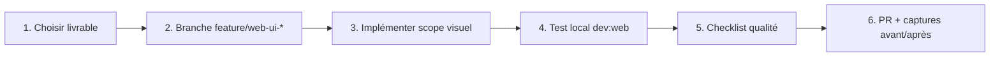

# Africa Tourism Gate — Workflow améliorations design Web

> **Document de référence UX/UI** — workflow et livrables pour l’application publique `apps/web`.  
> **Mise à jour : juin 2026** — Basé sur l’état actuel du code (`packages/ui`, homepage, verticales, checkout).

---

## Comment utiliser ce document

1. Lisez la **synthèse d’état actuel** pour identifier les écarts visuels les plus visibles.
2. Choisissez un **livrable WEB-UX-[N]** dans le tableau récapitulatif.
3. Vérifiez les **dépendances** (fondations partagées, livrables admin `UX-1` si composants manquants dans `packages/ui`).
4. Copiez le **prompt détaillé** correspondant dans Cursor Agent.
5. Créez la **branche PR** indiquée, implémentez, testez avec `pnpm dev:web`.
6. Validez avec la **checklist qualité** et, si pertinent, les specs Playwright (`apps/web/tests/e2e/`).
7. Croisez avec [roadmap-development.md](./roadmap-development.md) (fonctionnel) et [admin-design-improvements.md](./admin-design-improvements.md) (design system partagé).
8. Ne demandez un commit que lorsque vous êtes satisfait du résultat.

### Légende des priorités

| Priorité    | Signification                                                                 |
| ----------- | ----------------------------------------------------------------------------- |
| **Haute**   | Impact direct sur conversion, confiance ou cohérence multi-verticales         |
| **Moyenne** | Amélioration notable, implémentable verticale par verticale                    |
| **Basse**   | Polish marketing, micro-interactions, confort avancé                          |

### Prompt méta (modèle réutilisable)

```
Projet : Africa Tourism Gate (pnpm monorepo).
Branche : crée et bascule sur `[BRANCHE]`.

Livrable WEB-UX-[N] : [TITRE]
Références :
- apps/web (Next.js 14, App Router, next-intl FR/EN/ES)
- packages/ui, packages/config/theme.css
- docs/web-design-improvements.md, docs/roadmap-development.md
- Pattern de référence hôtels : apps/web/components/hotels/, app/hotels/

Règles design :
- Réutiliser @africatourismgate/ui et les tokens CSS (--atg-*).
- Branding dynamique (couleurs org) : ne pas hardcoder #0B6E4F sauf fallback documenté.
- Préférer composants partagés packages/ui plutôt que dupliquer dans apps/web.
- Mode clair + sombre testés ; mobile-first ≤ 768px.
- Textes via next-intl (apps/web/messages/fr.json, en.json, es.json) — pas de chaînes en dur.
- Ne pas refactorer hors scope du livrable WEB-UX.
- Pas de commit sauf si je le demande explicitement.

[PROMPT DÉTAILLÉ]

À la fin : résumer les fichiers modifiés, les IDs de suggestion couverts (ex. H1, BK2) et comment tester (pnpm dev:web + Playwright si parcours impacté).
```

---

## Workflow en 6 étapes



| Étape | Action | Outil / commande |
| ----- | ------ | ---------------- |
| 1 | Sélectionner WEB-UX-[N] + lire dépendances | Ce document |
| 2 | Créer branche depuis `main` | `git checkout -b feature/web-ui-…` |
| 3 | Implémenter (composants web + ui partagé si besoin) | Cursor Agent |
| 4 | Vérifier visuellement clair/sombre + mobile | `pnpm dev:web` → http://localhost:3002 |
| 5 | Parcours critique : recherche → fiche → checkout | Playwright si spec existante |
| 6 | Ouvrir PR avec titre `[WEB-UX-N] …` | gh pr create |

---

## Tableau récapitulatif — livrables design

| #        | Phase | Livrable                                      | Priorité | Branche PR                              | Dépend de        |
| -------- | ----- | --------------------------------------------- | -------- | --------------------------------------- | ---------------- |
| WEB-UX-1 | 1     | Fondations — composants web réutilisables     | Haute    | `feature/web-ui-foundation`             | —                |
| WEB-UX-2 | 1     | Tokens, typo & cohérence couleurs marketing   | Haute    | `feature/web-ui-theme-tokens`           | WEB-UX-1         |
| WEB-UX-3 | 2     | Header, footer & navigation globale           | Haute    | `feature/web-ui-shell`                  | WEB-UX-1         |
| WEB-UX-4 | 2     | Homepage — hero, sections marketing           | Haute    | `feature/web-ui-homepage`               | WEB-UX-1, WEB-UX-3 |
| WEB-UX-5 | 3     | Recherche unifiée — onglets & formulaires     | Haute    | `feature/web-ui-search-forms`           | WEB-UX-1         |
| WEB-UX-6 | 3     | Listes & filtres — pattern vertical           | Haute    | `feature/web-ui-listings`               | WEB-UX-1, WEB-UX-5 |
| WEB-UX-7 | 4     | Hôtels — fiche & galerie (référence)          | Moyenne  | `feature/web-ui-hotels-detail`          | WEB-UX-6         |
| WEB-UX-8 | 4     | Vols — liste, fiche, classes                  | Moyenne  | `feature/web-ui-flights`                | WEB-UX-6         |
| WEB-UX-9 | 4     | Locations véhicules                           | Moyenne  | `feature/web-ui-cars`                   | WEB-UX-6         |
| WEB-UX-10| 4     | Croisières — itinéraire & cabines             | Moyenne  | `feature/web-ui-cruises`                | WEB-UX-6         |
| WEB-UX-11| 4     | Activités / tours                             | Moyenne  | `feature/web-ui-activities`             | WEB-UX-6         |
| WEB-UX-12| 4     | Forfaits combinés                             | Moyenne  | `feature/web-ui-packages`               | WEB-UX-6         |
| WEB-UX-13| 5     | Sidebar réservation & sticky CTA              | Haute    | `feature/web-ui-booking-sidebar`        | WEB-UX-1         |
| WEB-UX-14| 5     | Parcours checkout (panier → paiement)         | Haute    | `feature/web-ui-checkout`               | WEB-UX-13        |
| WEB-UX-15| 6     | Espace compte client                          | Moyenne  | `feature/web-ui-account`                | WEB-UX-1, WEB-UX-3 |
| WEB-UX-16| 6     | Auth booking (login, OAuth, logout)           | Moyenne  | `feature/web-ui-booking-auth`           | WEB-UX-3         |
| WEB-UX-17| 6     | Support, FAQ & avis                           | Moyenne  | `feature/web-ui-support-reviews`        | WEB-UX-1         |
| WEB-UX-18| 7     | Empty states & pages coming-soon              | Moyenne  | `feature/web-ui-empty-states`             | WEB-UX-1         |
| WEB-UX-19| 7     | Mobile, responsive & touch                    | Haute    | `feature/web-ui-mobile-polish`            | WEB-UX-1         |
| WEB-UX-20| 7     | Performance perçue & skeletons                | Moyenne  | `feature/web-ui-loading-states`           | WEB-UX-1         |

### Phases

| Phase | Objectif                                              |
| ----- | ----------------------------------------------------- |
| **1** | Composants web partagés, tokens, cohérence visuelle   |
| **2** | Shell marketing (header/footer) + homepage            |
| **3** | Recherche et grilles de résultats multi-verticales    |
| **4** | Fiches produit par vertical                           |
| **5** | Réservation et checkout                               |
| **6** | Compte client, auth, support                          |
| **7** | Empty states, mobile, finitions                       |

### Ordre d'exécution recommandé

```
WEB-UX-1 → WEB-UX-2 → WEB-UX-3 → WEB-UX-4 → WEB-UX-5 → WEB-UX-6
                                              ↓
WEB-UX-7 (référence hôtels) → WEB-UX-8, WEB-UX-9, WEB-UX-10, WEB-UX-11, WEB-UX-12 (parallèle)
WEB-UX-13 → WEB-UX-14
WEB-UX-3 → WEB-UX-15, WEB-UX-16
WEB-UX-17 → WEB-UX-18 → WEB-UX-19 → WEB-UX-20
```

> **Synergie admin :** si `UX-1` admin ajoute `Select`, `Modal`, `Toast`, `Skeleton` dans `packages/ui`, les réutiliser côté web plutôt que recréer.

---

## Conventions de branches PR

- Préfixe : `feature/web-ui-*`
- Une PR = un livrable WEB-UX testable visuellement
- Titre PR exemple : `[WEB-UX-6] Web design: unified listing filters & product cards`
- Corps PR : résumé + IDs suggestion couverts + plan de test + captures avant/après (desktop + mobile)
- Ne pas mélanger refonte fonctionnelle (#67–72 roadmap) et polish pur — séparer PRs si les deux sont nécessaires

---

## État actuel (synthèse)

| Aspect                     | État | Observation                                                                 |
| -------------------------- | ---- | --------------------------------------------------------------------------- |
| Design system partagé      | ⚠️   | `Button`, `Card`, `Input`, `AppShell` — cartes produit dupliquées par vertical |
| Homepage marketing         | ✅   | Hero, onglets recherche, destinations, partenaires, i18n FR/EN/ES           |
| Header / footer            | ✅   | Nav multi-verticales, thème clair/sombre, langue, branding dynamique        |
| Recherche hôtels           | ✅   | Formulaire + liste + fiche riche (galerie, chambres, avis) — **référence**  |
| Autres verticales          | ⚠️   | Pages présentes ; cohérence visuelle inégale vs hôtels                      |
| Cartes produit             | ⚠️   | `HotelCard`, `FlightCard`, `CarCard`… — patterns similaires mais non unifiés |
| Sidebar réservation        | ⚠️   | Un sidebar par vertical ; structure proche mais styles divergents           |
| Checkout                   | ⚠️   | Fonctionnel (Stripe) ; étapes visuelles peu guidées                         |
| Compte client              | ⚠️   | `AccountShell` basique ; nav latérale simple                                |
| i18n                       | ⚠️   | next-intl en place ; `vertical-search-page.tsx` et quelques labels EN en dur |
| Feedback utilisateur       | ❌   | Peu de toasts ; erreurs souvent texte inline                                |
| Mobile                     | ⚠️   | Header responsive OK ; sidebars booking et galeries à optimiser             |
| SEO / Open Graph           | ✅   | Metadata layout root ; à enrichir par page produit                          |
| Tests visuels automatisés  | ⚠️   | Playwright parcours fonctionnels ; pas de régression visuelle                 |

---

## Fondations transverses

> **Livrables : WEB-UX-1, WEB-UX-2**

Ces améliorations bénéficient à **toutes** les verticales. Privilégier `packages/ui` pour ce qui est réutilisable admin + web.

**Branche WEB-UX-1 :** `feature/web-ui-foundation`  
**Branche WEB-UX-2 :** `feature/web-ui-theme-tokens`

### 1. Composants web à extraire ou unifier

| Composant              | Priorité  | Description                                                                 |
| ---------------------- | --------- | --------------------------------------------------------------------------- |
| `ProductCard`          | **Haute** | Image, titre, meta, prix, CTA — base pour hôtel/vol/voiture/croisière/activité |
| `SearchFormShell`      | **Haute** | Conteneur formulaire recherche (tabs + champs + submit)                     |
| `FilterBar`            | **Haute** | Tri, filtres, compteur résultats — listes verticales                        |
| `PageHero`             | **Moyenne** | Titre page liste/détail + breadcrumb + description                        |
| `PriceDisplay`         | **Moyenne** | Prix barré, devise, « à partir de », taxes incluses                       |
| `StarRating`           | **Moyenne** | Unifier `hotels/star-rating.tsx` et duplications inline                     |
| `BookingSidebarShell`  | **Haute** | Layout sticky : récap, dates, CTA réserver                                  |
| `EmptyState`           | **Moyenne** | Illustration légère + message + CTA retour recherche                      |
| `Skeleton` variants    | **Moyenne** | Carte, galerie, sidebar — aligner admin UX-1 si disponible                  |

### 2. Typographie & espacement (WEB-UX-2)

| ID  | Suggestion                         | Priorité  |
| --- | ---------------------------------- | --------- |
| T1  | Échelle typo documentée (h1 hero → h3 carte) | **Haute** |
| T2  | Remplacer `#0f1a16`, `gray-*` ad hoc par `text-atg-fg`, `text-atg-muted` | **Haute** |
| T3  | Espacement sections marketing (`py-16`, `gap-8`) harmonisé | **Moyenne** |
| T4  | Montserrat : graisses cohérentes (700 titres, 600 sous-titres) | **Moyenne** |

### 3. Couleurs & thème (WEB-UX-2)

| ID  | Suggestion                                    | Priorité  |
| --- | --------------------------------------------- | --------- |
| C1  | Vérifier contraste CTA primary sur hero photo | **Haute** |
| C2  | Badges statut réservation (confirmé, annulé…) | **Moyenne** |
| C3  | États hover/focus identiques sur toutes cartes | **Moyenne** |

---

## Par module — suggestions prioritaires

### Shell & homepage (WEB-UX-3, WEB-UX-4)

| ID  | Suggestion                              | Priorité  |
| --- | --------------------------------------- | --------- |
| S1  | Header : état actif cohérent sur toutes routes | **Haute** |
| S2  | Menu mobile : animation + focus trap    | **Moyenne** |
| S3  | Footer : liens verticales + contact + réseaux sociaux alignés | **Moyenne** |
| S4  | Hero : CTA secondaire + preuve sociale  | **Moyenne** |
| S5  | Carousel destinations : lazy load images | **Moyenne** |
| S6  | Section verticales : icônes + hover unifiés | **Basse** |

### Recherche & listes (WEB-UX-5, WEB-UX-6)

| ID  | Suggestion                                      | Priorité  |
| --- | ----------------------------------------------- | --------- |
| L1  | Onglets recherche → routes dédiées (pas tout `/hotels`) | **Haute** |
| L2  | Formulaires vol/voiture/croisière/activité alignés sur hôtels | **Haute** |
| L3  | Grille responsive : 1 col mobile, 2–3 desktop     | **Haute** |
| L4  | Filtres latéraux collapsibles mobile              | **Moyenne** |
| L5  | Pagination ou infinite scroll avec skeleton       | **Moyenne** |
| L6  | i18n complète sur `vertical-search-page.tsx`    | **Haute** |

### Fiches produit (WEB-UX-7 à WEB-UX-12)

| ID  | Vertical    | Suggestion clé                                      | Priorité  |
| --- | ----------- | --------------------------------------------------- | --------- |
| H1  | Hôtels      | Galerie lightbox + miniatures clavier               | **Moyenne** |
| H2  | Hôtels      | Calendrier disponibilité plus lisible mobile        | **Haute** |
| F1  | Vols        | Timeline escales visuelle                           | **Haute** |
| F2  | Vols        | Comparaison classes tarifaires                      | **Moyenne** |
| V1  | Voitures    | Specs véhicule en badges                            | **Moyenne** |
| CR1 | Croisières  | Carte itinéraire / ports                            | **Moyenne** |
| A1  | Activités   | Créneaux horaires en chips sélectionnables          | **Haute** |
| P1  | Forfaits    | Stepper composition forfait côté client             | **Moyenne** |

### Checkout & réservation (WEB-UX-13, WEB-UX-14)

| ID  | Suggestion                                           | Priorité  |
| --- | ---------------------------------------------------- | --------- |
| BK1 | Sidebar sticky unifiée (dates, voyageurs, total)     | **Haute** |
| BK2 | Stepper checkout : panier → identité → paiement → confirmation | **Haute** |
| BK3 | Récap ligne par ligne avec icône vertical            | **Moyenne** |
| BK4 | Page succès : prochaines étapes + lien compte        | **Moyenne** |
| BK5 | États erreur paiement Stripe plus explicites         | **Haute** |

### Compte & support (WEB-UX-15 à WEB-UX-17)

| ID  | Suggestion                                    | Priorité  |
| --- | --------------------------------------------- | --------- |
| AC1 | Nav compte : onglets ou sidebar plus visible  | **Moyenne** |
| AC2 | Liste réservations : badges statut + filtres  | **Haute** |
| AC3 | Détail réservation : timeline statuts         | **Moyenne** |
| AU1 | Pages login booking : aligner sur carte auth admin/web | **Moyenne** |
| SP1 | FAQ accordéon accessible                      | **Moyenne** |
| RV1 | Formulaire avis post-séjour : étoiles + upload | **Moyenne** |

### Finitions (WEB-UX-18 à WEB-UX-20)

| ID  | Suggestion                         | Priorité  |
| --- | ---------------------------------- | --------- |
| E1  | `coming-soon` et `[vertical]` : illustration + CTA retour | **Moyenne** |
| M1  | Touch targets ≥ 44px sur CTA mobile | **Haute** |
| M2  | Galeries swipe mobile               | **Moyenne** |
| LD1 | Skeleton listing + fiche            | **Moyenne** |
| LD2 | Suspense boundaries par section lourde | **Basse** |

---

## Checklist qualité par PR design

- [ ] Utilise composants fondation WEB-UX-1 (ou pattern documenté)
- [ ] Tokens `--atg-*` / classes `text-atg-fg` — pas de gris hardcodés nouveaux
- [ ] Mode clair + sombre vérifiés
- [ ] Responsive testé ≤ 768px (sidebar, grilles, nav)
- [ ] Textes via `apps/web/messages/*.json` (fr, en, es)
- [ ] Images : `alt` descriptif, lazy loading si liste
- [ ] Focus visible et navigation clavier sur formulaires
- [ ] CTA primaire unique par zone (pas de concurrence visuelle)
- [ ] États vides : message + action de repli
- [ ] États loading : skeleton ou spinner bouton
- [ ] Branding org (couleur primary) reste lisible sur hero et boutons
- [ ] Playwright : spec existante passante si parcours modifié

---

## Commandes utiles

```bash
# Dev local web
pnpm dev:web

# Build de vérification
pnpm --filter @africatourismgate/web build

# Tests E2E (après changement checkout/compte)
pnpm --filter @africatourismgate/web test:e2e

# Parité i18n (si nouvelles clés)
node scripts/check-i18n-parity.mjs
```

---

## Prompts détaillés (copier-coller dans Cursor Agent)

### WEB-UX-1 — Fondations — composants web réutilisables

**Branche :** `feature/web-ui-foundation`

```
Projet : Africa Tourism Gate (pnpm monorepo).
Branche : crée et bascule sur `feature/web-ui-foundation`.

Livrable WEB-UX-1 : Fondations — composants web réutilisables
Références :
- apps/web/components/hotels/hotel-card.tsx (pattern carte la plus aboutie)
- packages/ui/src/components/
- docs/web-design-improvements.md

Objectif :
- Créer ou extraire dans packages/ui (si réutilisable admin) ou apps/web/components/shared/ :
  ProductCard (slots image, title, meta, price, actions)
  PageHero (breadcrumb, title, description)
  PriceDisplay, StarRating (depuis hotels/star-rating)
  EmptyState, FilterBar (structure de base)
- Migrer au moins HotelCard pour utiliser ProductCard sans régression visuelle.
- Documenter les props dans un commentaire JSDoc bref.

Contraintes :
- Pas de changement fonctionnel API.
- i18n : props labels passées par le parent, pas de texte en dur dans ui.
- Tests manuels : /hotels liste + homepage.

À la fin : fichiers modifiés, IDs T1–T2 couverts si applicable, commandes test.
```

### WEB-UX-2 — Tokens, typo & cohérence couleurs

**Branche :** `feature/web-ui-theme-tokens`

```
Livrable WEB-UX-2 : Tokens, typo & cohérence couleurs marketing
Branche : `feature/web-ui-theme-tokens`
Dépend de WEB-UX-1.

Objectif :
- Audit des classes ad hoc (gray-*, #0f1a16) dans apps/web/components/
- Remplacer par tokens atg-* là où c'est un simple swap sémantique
- Ajouter en tête de docs/web-design-improvements.md ou commentaire theme.css l'échelle typo web (hero h1, page h1, card title)
- Vérifier contraste CTA sur hero homepage (C1)

Scope limité : pas de refonte layout, uniquement tokens et typo.
```

### WEB-UX-3 — Header, footer & navigation globale

**Branche :** `feature/web-ui-shell`

```
Livrable WEB-UX-3 : Header, footer & navigation globale
Branche : `feature/web-ui-shell`

Fichiers : apps/web/components/home/home-header.tsx, home-footer.tsx

Objectif :
- État actif nav cohérent (S1) sur /hotels, /flights, /account, etc.
- Menu mobile : focus trap, fermeture Escape (S2)
- Footer : groupe liens produits + contact (S3)
- i18n : aucune chaîne nouvelle en dur

Test : naviguer toutes verticales + compte, clair/sombre, 375px width.
```

### WEB-UX-4 — Homepage — hero & sections marketing

**Branche :** `feature/web-ui-homepage`

```
Livrable WEB-UX-4 : Homepage — hero, sections marketing
Branche : `feature/web-ui-homepage`

Fichiers : apps/web/app/page.tsx, components/home/*

Objectif :
- Polish hero-search, destinations-carousel, verticals-section, partners-section
- Lazy loading images carousel (S5)
- Cohérence espacements WEB-UX-2
- Conserver SEO metadata existant

Test : / en fr, en, es + dark mode.
```

### WEB-UX-5 — Recherche unifiée — onglets & formulaires

**Branche :** `feature/web-ui-search-forms`

```
Livrable WEB-UX-5 : Recherche unifiée — onglets & formulaires
Branche : `feature/web-ui-search-forms`

Références :
- components/home/search-tabs.tsx, hero-search.tsx
- lib/search/route.ts

Objectif :
- SearchFormShell partagé
- Chaque onglet soumet vers la bonne route vertical (L1)
- Formulaires vols, voitures, croisières, activités alignés visuellement sur hôtels (L2)

Ne pas implémenter nouvelles API — design et routing uniquement si déjà supporté.
```

### WEB-UX-6 — Listes & filtres — pattern vertical

**Branche :** `feature/web-ui-listings`

```
Livrable WEB-UX-6 : Listes & filtres — pattern vertical
Branche : `feature/web-ui-listings`

Objectif :
- Unifier grilles résultats (L3) : hotels, flights, cars, cruises, activities, packages
- FilterBar + EmptyState (L4, L5)
- Corriger vertical-search-page.tsx : i18n complète (L6), supprimer texte EN en dur
- ProductCard pour toutes les listes où applicable

Référence visuelle : apps/web/components/hotels/hotels-page-content.tsx
```

### WEB-UX-7 — Hôtels — fiche & galerie (référence)

**Branche :** `feature/web-ui-hotels-detail`

```
Projet : Africa Tourism Gate (pnpm monorepo).
Branche : crée et bascule sur `feature/web-ui-hotels-detail`.

Livrable WEB-UX-7 : Hôtels — fiche & galerie (référence)
Dépend de : WEB-UX-1, WEB-UX-6

Références :
- apps/web/components/hotels/hotel-detail-page-content.tsx
- hotel-gallery.tsx, hotel-stay-calendar.tsx, hotel-booking-sidebar.tsx
- docs/web-design-improvements.md (IDs H1, H2)

Implémenter :
- H1 : Galerie lightbox (clic miniature → plein écran, Escape pour fermer, focus trap)
- H2 : Calendrier disponibilité plus lisible mobile (taille cellules, légende couleurs)
- Harmoniser tokens atg-* sur la fiche (remplacer gray-* / #0f1a16 restants)
- PageHero ou breadcrumb cohérent : Accueil › Hôtels › {nom}

Contraintes :
- Ne pas casser le flux réservation existant (#reserve, sidebar)
- i18n : apps/web/messages/fr.json, en.json, es.json

Critères :
- Fiche utilisable au clavier (galerie, calendrier)
- Test manuel : /hotels/[id] clair/sombre, 375px

À la fin : fichiers modifiés, IDs H1–H2, commandes test.
```

### WEB-UX-8 — Vols — liste, fiche, classes

**Branche :** `feature/web-ui-flights`

```
Projet : Africa Tourism Gate (pnpm monorepo).
Branche : crée et bascule sur `feature/web-ui-flights`.

Livrable WEB-UX-8 : Vols — liste, fiche, classes
Dépend de : WEB-UX-6

Références :
- apps/web/components/flights/ (flights-page-content, flight-card, flight-detail-page-content)
- flight-itinerary-section.tsx, flight-classes-section.tsx, flight-booking-sidebar.tsx
- docs/roadmap-development.md livrable #67 (fonctionnel — ne pas mélanger si gros scope)

Implémenter :
- F1 : Timeline escales visuelle améliorée (badges IATA, durée, stack mobile)
- F2 : Comparaison classes tarifaires en cards grid sélectionnables
- ProductCard sur flights-page-content si WEB-UX-1 livré
- Aligner styles sur fiche hôtel (sections rounded-2xl, tokens atg)

Critères :
- flight-itinerary-section lisible ≤ 768px (stack vertical)
- Spec Playwright flight-checkout.spec.ts passante

À la fin : fichiers modifiés, IDs F1–F2, pnpm dev:web + test:e2e flight-checkout si touché.
```

### WEB-UX-9 — Locations véhicules

**Branche :** `feature/web-ui-cars`

```
Projet : Africa Tourism Gate (pnpm monorepo).
Branche : crée et bascule sur `feature/web-ui-cars`.

Livrable WEB-UX-9 : Locations véhicules — design
Dépend de : WEB-UX-6

Références :
- apps/web/components/cars/ (cars-page-content, car-card, car-detail-page-content, car-booking-sidebar)
- docs/roadmap-development.md livrable #68

Implémenter :
- V1 : Specs véhicule en badges (places, transmission, carburant, climatisation) avec icônes SVG
- Liste : ProductCard / car-card unifié avec photo ou placeholder gradient
- Fiche : sections Infos | Équipements | Conditions alignées pattern hôtel

Critères :
- Cohérent visuellement avec WEB-UX-7 (hôtels référence)
- i18n complète sur labels specs

À la fin : fichiers modifiés, ID V1, test /cars et /cars/[id].
```

### WEB-UX-10 — Croisières — itinéraire & cabines

**Branche :** `feature/web-ui-cruises`

```
Projet : Africa Tourism Gate (pnpm monorepo).
Branche : crée et bascule sur `feature/web-ui-cruises`.

Livrable WEB-UX-10 : Croisières — itinéraire & cabines
Dépend de : WEB-UX-6

Références :
- apps/web/components/cruises/ (cruises-page-content, cruise-card, cruise-detail-page-content)
- cruise-itinerary-section.tsx, cruise-cabins-section.tsx, cruise-booking-sidebar.tsx
- docs/roadmap-development.md livrables #69, spec cruise-checkout.spec.ts

Implémenter :
- CR1 : Timeline ports (ordre, dates, nom port) — horizontal desktop, vertical mobile
- Cabines en cards avec capacité, pont, prix « à partir de »
- cruise-card aligné ProductCard

Critères :
- Parcours fiche → sélection cabine → sidebar clair
- cruise-checkout.spec.ts passante si checkout touché

À la fin : fichiers modifiés, ID CR1, test /cruises/[id].
```

### WEB-UX-11 — Activités / tours

**Branche :** `feature/web-ui-activities`

```
Projet : Africa Tourism Gate (pnpm monorepo).
Branche : crée et bascule sur `feature/web-ui-activities`.

Livrable WEB-UX-11 : Activités / tours — design
Dépend de : WEB-UX-6

Références :
- apps/web/components/activities/ (activities-page-content, activity-card, activity-detail-page-content)
- activity-schedules-section.tsx, activity-booking-sidebar.tsx
- docs/roadmap-development.md livrable #70, activity-checkout.spec.ts

Implémenter :
- A1 : Créneaux horaires en chips sélectionnables (état selected, disabled si complet)
- activity-card : durée, niveau difficulté, note si disponible
- EmptyState si aucun créneau sur la période

Critères :
- Sélection créneau reflétée dans sidebar réservation
- Mobile : chips scroll horizontal ou wrap lisible

À la fin : fichiers modifiés, ID A1, test /activities/[id].
```

### WEB-UX-12 — Forfaits combinés

**Branche :** `feature/web-ui-packages`

```
Projet : Africa Tourism Gate (pnpm monorepo).
Branche : crée et bascule sur `feature/web-ui-packages`.

Livrable WEB-UX-12 : Forfaits combinés — design
Dépend de : WEB-UX-6

Références :
- apps/web/components/packages/ (packages-page-content, package-card, package-detail-page-content)
- package-items-section.tsx, package-*-config-section.tsx, package-booking-sidebar.tsx
- docs/roadmap-development.md livrable #71, package-checkout.spec.ts

Implémenter :
- P1 : Stepper composition forfait côté client (étapes : aperçu items → config par vertical → récap)
- package-card : badge « forfait », économie estimée si calculable
- package-resolved-summary plus scannable (icônes par type produit)

Critères :
- Utilisateur comprend la progression sans lire tout le détail technique
- package-checkout.spec.ts passante

À la fin : fichiers modifiés, ID P1, test /packages/[id].
```

### WEB-UX-13 — Sidebar réservation & sticky CTA

**Branche :** `feature/web-ui-booking-sidebar`

```
Livrable WEB-UX-13 : Sidebar réservation unifiée
Branche : `feature/web-ui-booking-sidebar`

Fichiers : *-booking-sidebar.tsx dans hotels, flights, cars, cruises, activities, packages

Objectif :
- BookingSidebarShell commun (BK1)
- Même structure : dates/sélection, détail prix, CTA, trust hints
- Sticky desktop, drawer ou bloc bas mobile (M1)

Test : fiche hôtel + vol + activité, 375px.
```

### WEB-UX-14 — Parcours checkout

**Branche :** `feature/web-ui-checkout`

```
Livrable WEB-UX-14 : Parcours checkout — design stepper
Branche : `feature/web-ui-checkout`

Fichiers : apps/web/app/booking/, apps/web/app/reservations/, components/reservations/

Objectif :
- Stepper visuel BK2 sur panier → recap → paiement → success/cancel
- Récap lignes BK3, page succès BK4, erreurs Stripe BK5
- Ne pas casser specs Playwright : reservation-checkout, flight-checkout, etc.

Lancer : pnpm --filter @africatourismgate/web test:e2e après changements.
```

### WEB-UX-15 — Espace compte client

**Branche :** `feature/web-ui-account`

```
Projet : Africa Tourism Gate (pnpm monorepo).
Branche : crée et bascule sur `feature/web-ui-account`.

Livrable WEB-UX-15 : Espace compte client — design
Dépend de : WEB-UX-1, WEB-UX-3

Références :
- apps/web/components/account/ (account-shell.tsx, account-bookings-list.tsx, account-booking-detail.tsx)
- apps/web/app/account/**/*
- Specs : customer-account.spec.ts, customer-loyalty.spec.ts

Implémenter :
- AC1 : Nav compte — sidebar ou tabs plus visible (état actif, icônes optionnelles)
- AC2 : Liste réservations — badges statut colorés (confirmé, en attente, annulé) + filtre rapide
- AC3 : Détail réservation — timeline statuts si données API disponibles, sinon placeholder structuré
- Harmoniser breadcrumb account-shell avec PageHero

Critères :
- Parcours /account/reservations → détail lisible mobile
- customer-account.spec.ts passante

À la fin : fichiers modifiés, IDs AC1–AC3, test:e2e customer-account.
```

### WEB-UX-16 — Auth booking (login, OAuth, logout)

**Branche :** `feature/web-ui-booking-auth`

```
Projet : Africa Tourism Gate (pnpm monorepo).
Branche : crée et bascule sur `feature/web-ui-booking-auth`.

Livrable WEB-UX-16 : Auth booking — polish design
Dépend de : WEB-UX-3

Références :
- apps/web/components/reservations/booking-login-page-content.tsx
- booking-oauth-callback-page-content.tsx, booking-logout-page-content.tsx
- apps/web/app/booking/login/page.tsx
- Specs : booking-login.spec.ts, booking-google-oauth.spec.ts

Implémenter :
- AU1 : Carte auth centrée cohérente avec homepage (accent primary, ombre, dark mode)
- États loading sur boutons OAuth / email
- Messages erreur inline accessibles (role=alert)
- Lien retour panier / accueil visible

Critères :
- Pas de régression flux OAuth Google
- booking-login.spec.ts + booking-google-oauth.spec.ts passantes

À la fin : fichiers modifiés, ID AU1, captures login clair/sombre.
```

### WEB-UX-17 — Support, FAQ & avis

**Branche :** `feature/web-ui-support-reviews`

```
Projet : Africa Tourism Gate (pnpm monorepo).
Branche : crée et bascule sur `feature/web-ui-support-reviews`.

Livrable WEB-UX-17 : Support, FAQ & avis — design
Dépend de : WEB-UX-1

Références :
- apps/web/components/support/ (support-page-content.tsx, support-faq.tsx, support-ticket-form.tsx)
- apps/web/components/hotels/hotel-reviews-section.tsx
- apps/web/components/account/booking-review-form.tsx
- Specs : support.spec.ts, reviews.spec.ts

Implémenter :
- SP1 : FAQ accordéon accessible (aria-expanded, clavier Enter/Space)
- support-ticket-form : sections Cards, validation visuelle champs
- RV1 : Formulaire avis — étoiles interactives, compteur caractères, succès toast ou bannière
- hotel-reviews-section : avatars initiales, date relative i18n

Critères :
- support.spec.ts et reviews.spec.ts passantes
- i18n fr/en/es pour nouvelles chaînes

À la fin : fichiers modifiés, IDs SP1, RV1, test:e2e support + reviews.
```

### WEB-UX-18 — Empty states & pages coming-soon

**Branche :** `feature/web-ui-empty-states`

```
Projet : Africa Tourism Gate (pnpm monorepo).
Branche : crée et bascule sur `feature/web-ui-empty-states`.

Livrable WEB-UX-18 : Empty states & coming-soon
Dépend de : WEB-UX-1

Références :
- apps/web/components/coming-soon-page.tsx, vertical-coming-soon-page.tsx
- apps/web/app/coming-soon/**/*
- EmptyState (WEB-UX-1)

Implémenter :
- E1 : Pages coming-soon et [vertical] — illustration légère SVG ou emoji, titre + description i18n, CTA retour recherche/home
- Remplacer listes vides génériques par EmptyState (recherche sans résultat, compte sans réservation)
- Cohérence visuelle avec tokens atg (pas de bordures gray-100 ad hoc)

Critères :
- /coming-soon et /coming-soon/[vertical] testés fr/en/es
- Empty states sur au moins hotels + account/reservations

À la fin : fichiers modifiés, ID E1, liste pages mises à jour.
```

### WEB-UX-19 — Mobile, responsive & touch

**Branche :** `feature/web-ui-mobile-polish`

```
Projet : Africa Tourism Gate (pnpm monorepo).
Branche : crée et bascule sur `feature/web-ui-mobile-polish`.

Livrable WEB-UX-19 : Mobile & polish global
Dépend de : WEB-UX-1 (recommandé : après WEB-UX-13, WEB-UX-14)

Objectif :
- Parcours critique mobile : home → search → detail → sidebar → checkout
- M1 : touch targets ≥ 44px sur CTA, liens nav, chips
- M2 : galeries swipe (hôtels, croisières) sur touch
- Corriger débordements horizontaux (tableaux, grilles, sidebar)

Pages prioritaires :
- home-header menu mobile
- *-booking-sidebar.tsx (drawer / barre basse)
- hotel-gallery, checkout stepper

Livrer : liste pages testées + captures 375px clair/sombre.
```

### WEB-UX-20 — Performance perçue & skeletons

**Branche :** `feature/web-ui-loading-states`

```
Projet : Africa Tourism Gate (pnpm monorepo).
Branche : crée et bascule sur `feature/web-ui-loading-states`.

Livrable WEB-UX-20 : Performance perçue & skeletons
Dépend de : WEB-UX-1

Références :
- apps/web/components/hotels/hotel-detail-page-content.tsx (loading actuel)
- packages/ui Skeleton si disponible (admin UX-1)
- docs/web-design-improvements.md (IDs LD1, LD2)

Implémenter :
- LD1 : Skeleton listing (grille cartes) sur pages /hotels, /flights, /cars, /cruises, /activities, /packages
- LD1 : Skeleton fiche détail (galerie + sidebar + sections)
- LD2 (optionnel) : React Suspense boundaries sur sections lourdes (avis, chambres) si pattern déjà en place
- Boutons submit : spinner inline pendant fetch

Contraintes :
- Pas de changement logique fetch — uniquement états loading UI
- Éviter layout shift (skeleton même hauteur que contenu final)

Critères :
- Throttle réseau DevTools : pas d'écran blanc > 200ms sans feedback
- Test manuel homepage + fiche hôtel

À la fin : fichiers modifiés, IDs LD1–LD2, pages couvertes listées.
```

---

## Matrice docs associés

| Besoin              | Document                                      |
| ------------------- | --------------------------------------------- |
| Design system admin | [admin-design-improvements.md](./admin-design-improvements.md) |
| Features API / web  | [roadmap-development.md](./roadmap-development.md) |
| Domaines prod       | [production-domains.md](./production-domains.md) |
| i18n admin (futur)  | roadmap #79–80                                |

---

## Suivi d'avancement (à cocher manuellement)

| Livrable   | Statut | Date | PR |
| ---------- | ------ | ---- | -- |
| WEB-UX-1   | ☐      |      |    |
| WEB-UX-2   | ☐      |      |    |
| WEB-UX-3   | ☐      |      |    |
| WEB-UX-4   | ☐      |      |    |
| WEB-UX-5   | ☐      |      |    |
| WEB-UX-6   | ☐      |      |    |
| WEB-UX-7   | ☐      |      |    |
| WEB-UX-8   | ☐      |      |    |
| WEB-UX-9   | ☐      |      |    |
| WEB-UX-10  | ☐      |      |    |
| WEB-UX-11  | ☐      |      |    |
| WEB-UX-12  | ☐      |      |    |
| WEB-UX-13  | ☐      |      |    |
| WEB-UX-14  | ☐      |      |    |
| WEB-UX-15  | ☐      |      |    |
| WEB-UX-16  | ☐      |      |    |
| WEB-UX-17  | ☐      |      |    |
| WEB-UX-18  | ☐      |      |    |
| WEB-UX-19  | ☐      |      |    |
| WEB-UX-20  | ☐      |      |    |

---

*Document pour guider les PRs design web. Référencer WEB-UX-[N] et IDs suggestion (ex. H2, BK1) dans titres et corps de PR.*
